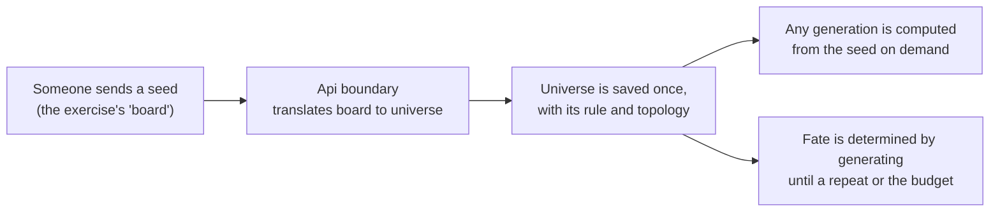
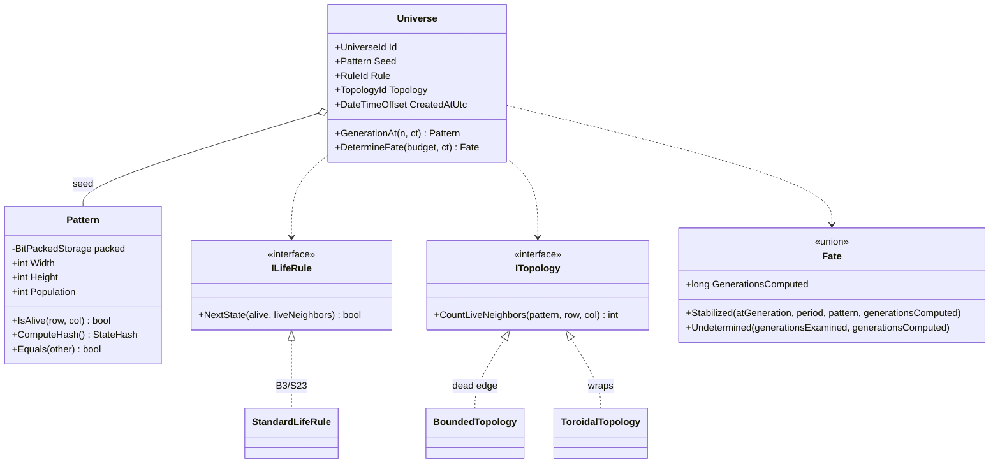
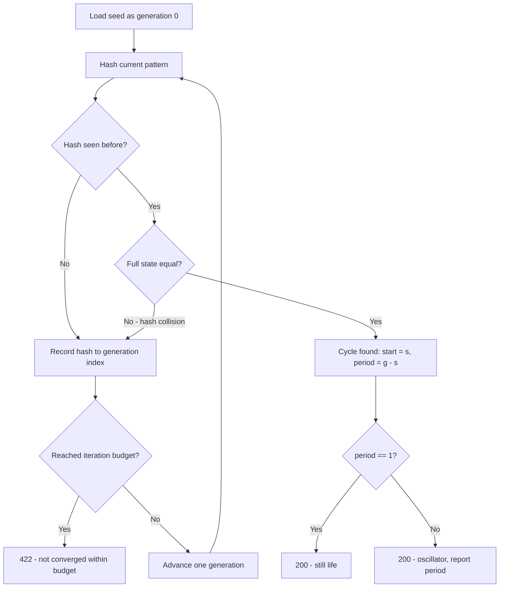
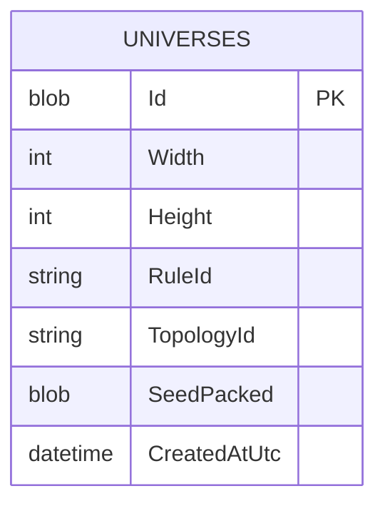
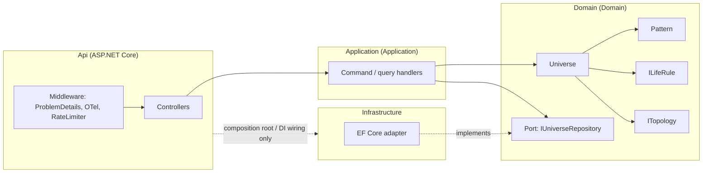
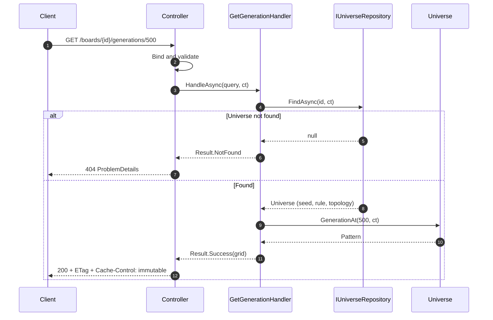
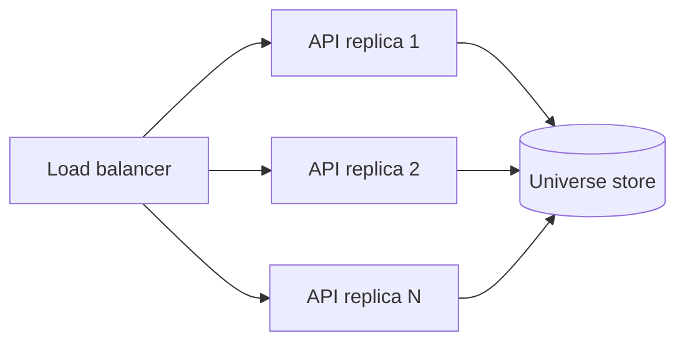
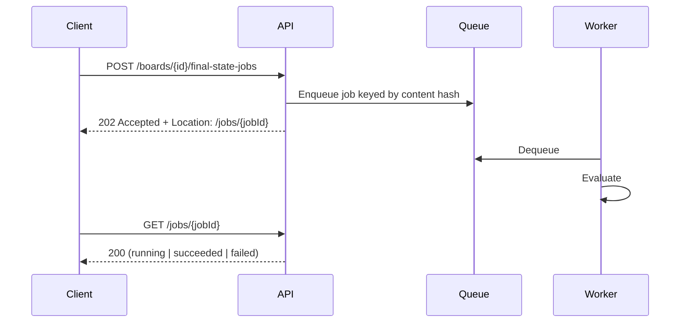

# Conway's Game of Life API: Design Document

**Status:** Draft for review
**Target:** C# / .NET 8 (`net8.0`)
**Author:** Nick Simmons

---

## 1. Begin with a story: a glider's short life

This API is for people exploring Conway's Game of Life. So the starting point is not a database table or an endpoint. It is the small, surprising thing shown in the [introduction to the Game of Life](https://www.youtube.com/watch?v=ouipbDkwHWA&t=5s): five cells that appear to fly.

### 1.1 The story

Picture a glider. Five live cells in a loose arrowhead, sitting in an otherwise empty universe. The glider has no idea it is a glider. It has no idea it is a spaceship, or that anything is about to happen to it at all. It is just five cells, and each of them knows exactly one thing: how many of its eight neighbours are alive.

Then the clock ticks. Every cell in the universe, all at the same instant, looks at its neighbours and follows three rules. A live cell with two or three live neighbours survives. A live cell with fewer or more than that dies. A dead cell with exactly three live neighbours is born. Nobody coordinates this. Nobody moves anything. Each cell attends only to its own small patch of the universe.

After the first tick the glider looks different, slightly askew. After the second, different again. After the fourth tick it is back to its original shape, except that it now sits one cell down and one cell to the right of where it started. It has travelled. It will do the same thing every four ticks for as long as the universe lets it, and it never once decided to.

That is what Life practitioners mean by a spaceship: a pattern that reappears with its original shape in a new place. The glider is the smallest one. The word describes something we noticed by watching. It is not something the glider carries, and not something we could have known by looking at the five cells before the first tick.

Eventually the glider reaches the edge of its universe, and here the story has two endings. If the universe simply stops at the edge, so that everything beyond it counts as dead, the glider loses the neighbours it needs, breaks apart, and is gone within a few ticks. If the universe instead wraps, so that the right edge joins the left and the top joins the bottom, the glider sails off one side and reappears on the other, and it will orbit forever. Same five cells. Same rules. Different universe, different fate.

### 1.2 What someone wants to ask

Somebody watching this wants to keep the glider. Not the whole flight, just the starting arrangement, the rules, and the shape of the universe it flew in. Given those three things, every tick that follows is determined; there is nothing else the flight could have depended on. Keeping the starting point *is* keeping the flight.

Then they want to ask questions of it. What does the glider look like after the next tick? After the hundredth? Does it settle into something still, or repeat, or is it still doing something new for longer than anyone is willing to wait?

Notice what they do not want. They do not want to *move* the glider forward and then ask where it is, because then two people asking at different times get different answers about the same glider. They want to ask about tick 100 today and get the same answer tomorrow.

### 1.3 Modelling the domain

The language above is not decorative. It is the domain, and the model should use it rather than translate it into something more generic.

The Game of Life literature already has a settled vocabulary, and this design adopts it directly rather than inventing friendlier synonyms. The thing the glider lives in is a **universe**, which is Wikipedia's own word for it. The five-cell arrowhead, and every subsequent arrangement of live and dead cells, is a **pattern**. The particular pattern you start with is the **seed**. Each tick produces a new **generation**. The three rules together are the **rule**, written B3/S23 in the standard notation. What happens at the edge is the universe's **topology**, which is the word Golly uses when it offers a plane, a cylinder, a torus, or a Möbius strip. And what a pattern eventually does, whether it dies, freezes, or repeats, is its **fate**, which is the word Conway himself used when tracking small patterns by hand.

Spaceship, still life, oscillator, and glider are also domain words, but of a different kind. They classify a pattern by its *behaviour*, and behaviour is something you discover by generating and watching. So they appear in this design as observations and as test cases, never as fields. There is no `IsSpaceship` flag anywhere, for the same reason the glider itself does not know it is one. "Glider" is a description at a different level than the cells: fully determined by them, useful precisely because it compresses them, and nothing over and above them. Keeping the two levels apart in the model is a principled choice rather than an aesthetic one (Dennett's "Real Patterns" makes this argument using Life itself).

Some of those words are technical. "Topology" in particular is a mathematician's term. But it is the domain's own technical term, and the point of ubiquitous language is to adopt the vocabulary the practitioners use rather than to replace it with something that sounds friendlier and means slightly less.

#### What the exercise calls it

The exercise talks about a **board**, and its HTTP routes should too, because that is the contract the reviewer will test against. Inside the domain, though, "board" does not appear. A board is what the outside world sends; a universe is what we keep. The web layer translates one to the other at the boundary and does not let the outer word leak in.

That translation is the only place where two vocabularies genuinely meet, and it is worth naming for what it is: a context boundary. The exercise has its own small language (board, cells, next, final) and the Life domain has its own (universe, seed, pattern, generation, fate). Each is internally consistent. They should not be merged, and one should not be allowed to rename the other.

#### On bounded contexts

I want to be careful here, because it is easy to call a layer a bounded context and thereby claim more than is true.

A bounded context is a boundary within which a term has one meaning. It earns the name when the same word means different things on either side, or when two groups of people describe the same thing in different words. By that test there is exactly one such boundary in this system today: the one just described, between the exercise's contract and the Life domain. "Board" on one side, "universe" on the other, and an explicit translation between them.

What there is *not* is a second context for storage. Saving a universe and evolving a universe use the same model of what a universe is, so splitting them would be a layer boundary wearing a bounded-context costume. The repository is a port *within* the Life context, expressed in the Life context's language, and it stores exactly one kind of thing. That is why it is `IUniverseRepository` rather than `IRepository<T>`: the generic form would suggest this application stores arbitrary things, and it does not. It stores universes.

There is one plausible future context, and naming it clarifies where the seam would fall. The Life community keeps a **pattern catalogue**: named patterns like Glider, Acorn, and Gosper glider gun, each with a discoverer, a year, and a standard interchange format. In a catalogue, a "pattern" carries provenance and a name. In evolution, a "pattern" is just cells. Same word, two meanings, which is the actual signal for a second context. Nothing in the exercise asks for it, so it is not built. But if it were, that is where the line goes.

### 1.4 High-level approach

The story implies the shape of the system directly.



A universe is saved exactly once, at the moment its seed arrives, and it is never changed afterwards. When someone asks for generation 100, the system starts from the seed and applies the rule 100 times. It does not remember generation 100, and it does not promote it to a new current state. The next generation is the same question with the number 1.

Asking for a pattern's fate means generating until either a pattern reappears, which is a cycle, or a budget is exhausted, in which case the honest answer is that the fate is undetermined within that budget rather than that the pattern never settles. Every finite universe settles eventually; the budget is a statement about our patience, not about the universe.

The topology and the rule are part of what gets saved, because they are part of what makes the flight what it is. The first release uses a bounded universe with a dead edge, since that is the literal reading of "upload a 2D grid," and a wrapping universe is a named alternative rather than a rewrite.

### 1.5 High-level implementation

Following the arrows left to right:

1. The web layer accepts the exercise's `board` representation, validates it, and hands a seed to a command handler.
2. The handler constructs a `Universe` from the seed, the standard rule, and the bounded topology, and asks `IUniverseRepository` to add it. The universe receives an identity at this point and never changes again.
3. A generation request finds the universe by identity and asks it for `GenerationAt(n)`, which returns a `Pattern`.
4. To produce that pattern, the universe applies the rule to every cell of the previous generation simultaneously. Each cell reads only its neighbours' previous state, never their new one; the order in which cells are visited must not matter.
5. A fate request asks the universe to `DetermineFate(budget)`, which generates while remembering what it has seen, and returns either the generation at which a cycle began and its period, or a statement that the budget was exhausted.
6. The web layer maps the result back into the exercise's vocabulary and status codes.

Nothing in steps 2 through 5 knows that HTTP exists or that a database exists. The domain model is plain code that can be exercised in a unit test with a seed and a number.

### 1.6 Why these choices follow from the story

Rather than a table of decisions, here is the reasoning as a chain, because each step depends on the one before.

The glider's flight is determined entirely by its seed, its rule, and its topology. So those three things are what we keep, and nothing else needs to be. That is the immutable-universe decision, and it is a consequence of how Life works rather than a preference about how to build software.

Because the universe is immutable, every question about it has one answer forever. So generations are computed rather than stored, responses can be cached without any invalidation, no two requests ever contend for the same state, and any replica can answer any question. Most of the concurrency and scaling design in later sections is simply this consequence, spelled out.

Because "spaceship" is something we notice rather than something the glider carries, the model holds facts and lets behaviour emerge. That is what keeps `Pattern` a plain value with no classification baked in, and it is why the test suite is built from published patterns whose behaviour is known: the tests check that the right behaviour emerges from the right seed, which is the only kind of correctness this domain has.

Because the edge of the universe changes the glider's fate, topology is part of the universe rather than a global setting. Two universes with the same seed and different topologies are different universes, and the model says so.

Because the exercise speaks of boards and the domain speaks of universes, and neither vocabulary should bend to the other, translation happens once at the boundary. That is the single bounded-context seam, and it is the reason the repository is named for what it stores rather than made generic.

The rest of this document is the detailed design behind those decisions. It separates the durable choices from the implementations that currently serve them, records rejected alternatives, and makes explicit what is not being built.

---

## 2. Requirements & interpretation

### 2.1 Functional (from the exercise)

| # | Requirement | Endpoint |
|---|---|---|
| 1 | Upload board state, return unique id | `POST /api/v1/boards` |
| 2 | Get next generation for a board | `GET /api/v1/boards/{id}/next` |
| 3 | Get state N generations ahead | `GET /api/v1/boards/{id}/generations/{n}` |
| 4 | Get final stable state, or a suitable error | `GET /api/v1/boards/{id}/final` |

### 2.2 Non-functional

- Board states survive process restart or crash.
- Clean, modular, testable; proper error handling and validation.
- Follows C# and .NET best practices.
- No authentication or authorization required.

### 2.3 Ambiguities in the prompt, and how they were resolved

The prompt leaves four things undefined. Each materially changes the design, so each is resolved explicitly rather than implicitly.

| Ambiguity | Resolution | Section |
|---|---|---|
| Is a universe mutable (does it "advance"), or is its seed fixed? | **Immutable seed.** Generations are computed, never stored. | [§3](#3-the-governing-insight-determinism) |
| What happens at the grid edge? | **Bounded universe, dead edge** by default; topology is a strategy. | [§4.3](#43-topology-and-why-it-decides-fate) |
| What does "final stable state" mean for an oscillator? | Detect **any cycle**; report `period` (1 = still life). | [§6](#6-final-state-resolution) |
| What is a "reasonable number of iterations"? | Configurable budget; exceeding it is `422`, not `500`. | [§6.3](#63-the-non-convergence-contract) |

---

## 3. The governing insight: determinism

> Generation *N* of a Game of Life universe is a pure, deterministic function of its seed, its rule, and its topology. Nothing else is input. There is no randomness, no clock, no external state.

I tend to think this single property, taken seriously, decides most of the architecture. If a universe is modelled as an immutable seed and every generation as a computation from that seed, a surprising amount falls out for free.

Every read endpoint becomes a pure `GET`: idempotent, safely retryable, free of side effects. Responses become permanently cacheable, and not as an optimisation bolted on afterwards; `ETag` with `Cache-Control: public, immutable` is correct by construction, because a given generation's content can never change. There is no shared mutable state on the request path, so there is no locking problem to solve at all, and concurrency control collapses into a question about CPU admission rather than correctness. Durable state is write-once, which means no partial updates, no torn writes, and no update migrations, so crash safety stops being much of a design problem. And horizontal scale needs no coordination, since any node can serve any request given only the seed, with the single caveat that the universe store has to permit it ([§7.3](#73-store-choice)).

That last consequence matters more than it first appears. It is the reason [§8.3](#83-service-boundaries) concludes this service does not yet need a queue or a separate worker tier.

### 3.1 The rejected alternative

The obvious alternative is a mutable universe holding a "current generation" that `POST /boards/{id}/next` advances.

As far as I can tell it is worse on every axis. Advancing becomes a non-idempotent write, which forces optimistic concurrency (`If-Match` or version columns) and 409-conflict handling. Responses stop being cacheable. "Get N ahead" turns ambiguous, since N is now relative to whatever the current generation happens to be. And crash safety becomes a real problem rather than a non-problem.

To be sure, I'm not saying a mutable model is never right. If the universe were a shared artifact that several clients edited collaboratively, it plainly would be. It just isn't that here, and it buys nothing in exchange for those costs.

### 3.2 A precise statement about termination

A finite $w \times h$ grid has exactly $2^{w \cdot h}$ possible states. Evolution is deterministic, so the sequence of states is eventually periodic: by the pigeonhole principle, every finite universe must eventually cycle. Termination is guaranteed in theory.

So the error case in requirement 4 is not "this pattern never stabilizes." It is precisely "this pattern's fate was not determined within our iteration budget." The API says exactly that, and reports how many generations it examined. That distinction drives the status-code choice in [§6.3](#63-the-non-convergence-contract).

---

## 4. Domain model

Everything in this section lives in the Life context described in [§1.3](#13-modelling-the-domain), and uses its vocabulary. The exercise's word "board" does not appear below this line except when quoting the HTTP contract.

### 4.1 Model



`Universe` is the aggregate. It owns a seed, a rule, and a topology, and it answers two questions: what does generation N look like, and what is this pattern's fate. `Pattern` is a value object for one arrangement of cells, whether that is the seed or generation ten thousand. `Fate` is the result of a search, and its two cases are the two honest answers that search can give.

A still life is a `Stabilized` fate with a period of one. The literature treats still lifes and oscillators as different kinds of thing, and the API response reports the period so a client can make that distinction, but the model does not need two cases for what is arithmetically one.

### 4.2 Pattern, rather than raw indexing

`Pattern` is the domain's name for an arrangement of cells. Its current storage is bit-packed in a `ulong[]` rather than a `bool[,]`. That buys three things: roughly eight times less cell-storage memory, which matters because seeds get serialized and persisted; cheap hashing for cycle detection, since hashing becomes a pass over the backing array rather than a nested loop; and room to vectorise neighbour counting later without disturbing the public surface. The earlier claim of 64 times less memory confused 64 cells per word with the saving relative to one byte per Boolean. At 256 by 256, the packed payload is 8 KiB rather than 64 KiB, excluding object headers and array padding.

The bit manipulation is fully encapsulated. Consumers see `IsAlive(row, col)`, `Width`, `Height`, and `Population`, and no caller ever computes an offset. `Pattern` is a value object: immutable, structurally equal, no identity.

The name was not the obvious one. `GenerationSnapshot` suggests itself, since most requests do return the arrangement at generation N. Three things ruled it out.

The type is not always a generation. It is also the seed: `Universe.Seed`, `CreateUniverseCommand(UniverseId, Pattern Seed)`, and the result of `Pattern.FromRows` at the boundary all hold one before any generation has been computed. It is likewise the type of the published oracles in the tests, where Block and Glider are patterns in the literature's sense rather than snapshots of a run.

Generation is already a separate thing in this model, an ordinal, and the pairing is explicit in `PatternView(UniverseId, int Generation, Pattern Pattern)`. Folding the ordinal into the type name would blur a distinction the code relies on, and the consequence is concrete rather than hypothetical. A blinker at generations 0 and 2 has identical cells, so those two patterns compare equal. That is correct, and under this name it reads as correct: the same arrangement, seen at two different generations. Under `GenerationSnapshot` the identical true statement, that two snapshots of different generations are equal, reads like a defect. [§5.5](#55-caching) describes the `ETag` collision this equality actually caused, which is what turned the argument from a stylistic preference into a demonstrated one.

Finally, "snapshot" claims something untrue here. It implies a point-in-time capture of something that changes and, usually, something stored; the universe is an immutable seed and generations are computed rather than persisted. `GENERATION_SNAPSHOTS` is also the name of the checkpoint table that was designed and then cut ([§7.2](#72-schema), ADR 010), so the word is already spoken for by a rejected concept. Reusing it would invite the question of where these are kept, and the answer is nowhere, deliberately.

#### Why the boundary takes primitives

`Pattern.FromRows` accepts an `IReadOnlyList<IReadOnlyList<int>>`, which sits oddly beside a domain that otherwise names everything: `UniverseId`, `RuleId`, `TopologyId`, `StateHash`, `Fate`, `Result<T>`. The asymmetry is deliberate, and worth stating, because wrapping those primitives in a type is a reasonable instinct that would make this worse rather than better.

`FromRows` is a parser: it takes a loosely structured input and returns a strongly structured output, or fails. `Pattern` is the output half, and it is where the benefit is actually banked, since an instance that exists is non-empty, rectangular, uniformly binary, and within the caps, and nothing downstream re-checks any of it. A type on the *input* side does not remove the parse, it relocates it. A `CellGrid` that enforced rectangularity would duplicate `Pattern`'s invariants and still need something to build it from the `int[][]` that arrived over HTTP. A `CellGrid` that enforced nothing would be a rename. The bytes on the wire are genuinely untyped, and exactly one function should be responsible for turning them into something that is not.

This is also where [§1.3](#13-modelling-the-domain)'s context boundary falls. A two-dimensional array of ones and zeroes is the exercise's vocabulary, not the Life domain's. Taking it raw at the single translation point and returning a `Pattern` is the boundary doing its job; a domain type on that parameter would pull the outer language inward.

The one candidate with real merit is the `(int row, int col)` pair on `IsAlive` and `CountLiveNeighbors`. Two interchangeable integers mean `IsAlive(col, row)` compiles, and distinct `Row` and `Column` structs would make that a compile error at no runtime cost, since the JIT erases single-field wrappers. I decided against the wrappers, on the grounds that the neighbour loops visit all eight offsets symmetrically. Checking that reasoning, though, found the tests were not covering what their names implied, which is the part worth recording.

The published oracles cannot detect a transposition. A blinker has period 2 in both orientations and a penta-decathlon has period 15 in both, so asserting a period says nothing about which axis is which; a reflected glider still translates by (1,1) every four generations. That left two tests whose names promised the property. `FromRows_reads_cells_in_row_major_order` seeded a two-by-two diagonal, which is symmetric under transposition and therefore passes whether rows and columns are swapped or not. `GetBoard_returns_the_seed_that_was_uploaded` asserted only that three rows came back, never comparing a cell. Neither could fail on orientation.

Both are now seeded asymmetrically and assert full contents, and the fix was verified by mutation rather than by inspection: transposing the index arithmetic inside `IsAlive` makes both fail, and under the previous assertions both passed. The lesson generalises past this one property. A test named for an invariant is not evidence that the invariant holds, and a symmetric fixture is the easiest way to write an assertion that cannot fail.

One gap has no C# answer. A cell is `0 | 1`, and a language with union types would say so in the signature. `net8.0` has none, which is the same limitation that gives [§10.2](#102-error-handling) a `Result<T>` rather than a discriminated union, so the constraint lives in a guard clause inside `FromRows` and nowhere else.

The rule remains a question about a cell: is it alive in the next generation? `StandardLifeRule.NextState` expresses the two positive cases with a tuple switch: `(false, 3)` means birth and `(true, 2 or 3)` means survival; every other case is dead. I prefer that small rule table to a fluent builder here, because there is no requirement to compose rules dynamically. An enum would rename the two Boolean states without adding a domain distinction. `ILifeRule` remains the seam for another rule.

Collection traversal uses `foreach`, with `WithIndex()` when both a value and its position matter. Pure projections, including HTTP rows, use LINQ. The evolution loop reuses column indices across rows, and both topologies iterate the same eight neighbour offsets without allocating per cell. Extensions such as `rule.Resolve()` and `errors.ToProblemDetails()` keep transformations next to their receiver; named factories such as `Pattern.FromRows` remain static.

### 4.3 Topology, and why it decides fate

The story in [§1.1](#11-the-story) ended two ways, and the difference was the edge of the universe. That is not a detail. It determines whether a pattern stabilizes at all.

On a bounded universe with a dead edge, a glider reaching the boundary loses the neighbours it needs and breaks apart, so most patterns settle fairly quickly. On a torus, that same glider wraps and orbits indefinitely, which guarantees a long cycle rather than a still life. Same seed, same rule, different fate.

Bounded is the default, since it matches the literal reading of "upload a 2D grid." Modelling the choice as `ITopology` rather than hard-coding it makes the torus a strategy swap rather than a rewrite. The same applies to `ILifeRule`: the standard rule is B3/S23, and HighLife (B36/S23) becomes configuration rather than code.

These are the only two extensibility seams in the domain, and I think they earn their place. Both are variation axes named in the source material rather than ones I invented, and topology is load-bearing for requirement 4 rather than decorative. [§9](#9-decisions-versus-implementations) applies the same test to everything else, and one candidate seam does not survive it.

---

## 5. API design

### 5.1 Resource model

HTTP keeps the exercise's word **board**, because that is the contract under test. It is the delivery name for a `Universe`, translated at the boundary as [§1.3](#13-modelling-the-domain) describes; the transport vocabulary does not rename the domain. Generations are sub-resources addressed by index.

| Method | Route | Purpose | Success |
|---|---|---|---|
| `POST` | `/api/v1/boards` | Save a seed, mint id | `201` + `Location` |
| `GET` | `/api/v1/boards/{id}` | Universe metadata and seed | `200` |
| `GET` | `/api/v1/boards/{id}/generations/{n}` | Pattern at generation N | `200` |
| `GET` | `/api/v1/boards/{id}/next` | Alias for `generations/1` | `200` |
| `GET` | `/api/v1/boards/{id}/final` | Fate, if determined within budget | `200` or `422` |

**On `POST` versus `PUT` for upload:** `POST`. The server mints the identifier, so the client cannot know the target URI in advance, which is the standard case for `POST`. `PUT` would imply a client-chosen id and an idempotent replace, and since seeds are write-once there is nothing to replace.

**On the `/next` alias:** under the immutable model, `next` is exactly `generations/1`. The alias exists so the delivered API maps cleanly onto the four bullets in the exercise, and it shares an implementation with the indexed route. It is a deliberate concession to the reader, and I'd drop it without much hesitation if the uniform model were the only audience.

### 5.2 Versioning

URL-segment versioning (`/api/v1/...`). Chosen over header or query-string versioning because it is visible in logs, traces, and cache keys, and it makes the routing table self-documenting. The version segment is present from day one so that adding `v2` is never a breaking restructure.

### 5.3 Representations

Request, using the spec-literal 2D array. This 15 by 15 seed places the standard five-cell glider
away from the boundary. After every four generations it has the same shape one cell down and one
cell right, which makes the API's immutable generation queries easy to see:

```json
{
  "cells": [
    [0,0,0,0,0,0,0,0,0,0,0,0,0,0,0],
    [0,0,0,0,0,0,0,0,0,0,0,0,0,0,0],
    [0,0,0,0,0,0,0,0,0,0,0,0,0,0,0],
    [0,0,0,0,0,0,0,0,0,0,0,0,0,0,0],
    [0,0,0,0,0,0,0,0,0,0,0,0,0,0,0],
    [0,0,0,0,0,0,1,0,0,0,0,0,0,0,0],
    [0,0,0,0,0,0,0,1,0,0,0,0,0,0,0],
    [0,0,0,0,0,1,1,1,0,0,0,0,0,0,0],
    [0,0,0,0,0,0,0,0,0,0,0,0,0,0,0],
    [0,0,0,0,0,0,0,0,0,0,0,0,0,0,0],
    [0,0,0,0,0,0,0,0,0,0,0,0,0,0,0],
    [0,0,0,0,0,0,0,0,0,0,0,0,0,0,0],
    [0,0,0,0,0,0,0,0,0,0,0,0,0,0,0],
    [0,0,0,0,0,0,0,0,0,0,0,0,0,0,0],
    [0,0,0,0,0,0,0,0,0,0,0,0,0,0,0]
  ]
}
```

Response:

```json
{
  "boardId": "0b5f...",
  "generation": 1,
  "width": 3,
  "height": 3,
  "population": 3,
  "cells": [[0,0,0],
            [1,1,1],
            [0,0,0]],
  "_links": {
    "self":  "/api/v1/boards/0b5f.../generations/1",
    "next":  "/api/v1/boards/0b5f.../generations/2",
    "final": "/api/v1/boards/0b5f.../final",
    "board": "/api/v1/boards/0b5f..."
  }
}
```

### 5.4 On HATEOAS and the N+1 concern

Full HATEOAS, meaning a hypermedia format such as HAL or JSON:API with client-driven navigation, is not implemented. For five endpoints with no workflow state, it would be ceremony without a payoff.

A small `_links` block is included, though, because it seems to me to earn its keep: it communicates that generations form a walkable sequence, and it hands the client the `final` affordance without out-of-band knowledge.

The N+1 risk I noted while planning turns out not to apply here, because links are generated from route templates rather than from data. Building `_links` performs no additional queries and no additional lookups. The N+1 problem in hypermedia APIs comes from resolving related entities in order to build links, and there are no related entities to resolve.

### 5.5 Caching

Because a generation's content is immutable, the caching story is stronger than it usually gets to be:

```
ETag: "v1-<boardId>-<n>"
Cache-Control: public, max-age=31536000, immutable
```

`If-None-Match` is honoured and returns `304`. GET uses weak comparison, so `W/"v1-<boardId>-<n>"` matches the corresponding strong validator; `*` matches an existing representation. The earlier strong-only comparison incorrectly returned `200` for those two cases. Existence and generation bounds are still checked, preserving `404` and `400`. This follows directly from [§3](#3-the-governing-insight-determinism), and it is correct without any invalidation strategy, because nothing exists that could invalidate it.

The validator is derived from identity rather than from content, and the first implementation got this wrong in a way worth recording. It used `"sha256-<state-hash>"`, a hash of the returned pattern. That is appealing, since the content is what a validator is supposed to identify, but it fails twice. It collides: a blinker at generations 0 and 2 has identical cells but is a different representation, carrying a different `generation` and different `_links`, so two distinct representations shared one strong validator. And it is useless for load, because the hash can only be computed *after* evolving the pattern, so a conditional request paid the full cost and then threw the body away. Measured at the cap, a `304` took 0.97 s against 0.98 s for the `200`: it saved 132 KB of bandwidth and no CPU at all. `python3 bench/probe.py cache` reports both, and now shows 0.003 s against 0.98 s.

Deriving the validator from the board id and generation index fixes both. Both are immutable, the pair uniquely determines the bytes, and neither requires computing anything, so `If-None-Match` is answered before the evolution loop starts. The `v1` prefix is the representation version, so changing the response shape invalidates previously issued validators. The existence check still runs, so a fabricated validator for an unknown board gets a `404` rather than a spurious `304`.

This is also the answer to whether a shared cache is needed once there is more than one node. The expensive work is now genuinely skippable on a conditional request, and because the validator is a pure function of immutable inputs, every node computes the same one without coordination. A shared HTTP cache in front of the load balancer absorbs the repeat reads, and it sits in front rather than behind, so it is unaffected by node count. That is a better fit for `public, immutable` responses than a distributed cache behind the balancer, which would still spend a request, a network hop, and a deserialisation to avoid work the validator already avoids. A distributed cache becomes interesting only for the case ADR 010 names, many *different* deep generations of the same universe spread across nodes, which is a measurement nobody has yet.

The `final` resource is not marked immutable, since its result depends on the configured iteration budget, and that is a server-side setting which can change.

---

## 6. Final-state resolution

### 6.1 Algorithm

Walk generations, hashing each state and recording the hash against its generation index. A repeated hash means a cycle, subject to collision verification.



### 6.2 Why a hash map, and why verify on hit

Three approaches were considered. Let A = width × height, K = ceiling(A / 64) packed words, and g be the number of forward evolution steps before a repeat. The table includes the working patterns, not just the detection bookkeeping. Compute bounds assume ordinary hash-table behaviour and no unequal patterns sharing a SHA-256 digest.

| Approach | Memory | Compute | Gives cycle start? |
|---|---|---|---|
| Store every full state, indexed by hash | O((g + 1) · K) | O(g · A) | Yes |
| **Hash to generation index** | O(K + g) | O(g · A), including one verification replay | **Yes** |
| Floyd / Brent cycle detection | O(K) | O(g · A), with extra evolution passes | Only with a second pass |

The hash map wins on the combination that matters here. It identifies the candidate cycle start during the forward walk, then verifies it by replay. Its bookkeeping scales with the generation count rather than retaining a grid per generation. Floyd retains a constant number of patterns, not a constant number of bytes independent of area. The earlier table omitted the area factor from time and the working patterns from space; those omissions are corrected above.

Collision verification is not optional. A hash hit is treated as a candidate only, and the full grid is compared before declaring a cycle. Skipping that step would mean a hash collision silently produces a wrong answer. The comparison itself costs O(K), but producing the candidate costs O(s · A), where s is the earlier generation index. A genuine cycle always triggers this replay, even though unequal patterns sharing a SHA-256 digest are extremely unlikely. The earlier description of replay as almost free was wrong.

Only the SHA-256 hashes and indices are retained during the walk, not a history of patterns. Retaining every packed state would cost roughly 40 MiB per in-flight request at the caps in [§10.1](#101-validation-and-input-bounds); hash bookkeeping costs a few hundred kilobytes instead. `Fate.Stabilized` now returns the already verified immutable pattern so the handler can include it without another replay. This is request-local reuse, not checkpointing, and GET still writes nothing.

For a cycle starting at s with period p, the normal successful request now performs 2s + p evolution steps: s + p searching and s verifying. Previously the handler recomputed generation s again, costing 3s + p. `Fate.GenerationsComputed` counts actual steps, including every verification attempt, separately from the existing response's search-progress count. The duration metric covers all that evolution because it now happens entirely inside `DetermineFate`. A budget B exhausted without any hash hits performs max(0, B - 1) steps, since the seed is examined too. Pathological unequal-state hash matches could cause repeated replays and O(B² · A) work; the normal O(B · A) bound is not an unconditional worst-case guarantee.

One `NextGeneration` takes O(A) time: eight neighbour positions per cell. `GenerationAt(n)` takes O(n · A) evolution time and O(K + width) auxiliary live storage, including reusable column indices, independent of n; total allocation over the call grows with n. Hashing and full equality take O(K), while HTTP `ToRows()` takes O(A) time and O(A) integer storage. No bit-parallel evolution is implemented.

### 6.3 The non-convergence contract

Per [§3.2](#32-a-precise-statement-about-termination), non-convergence is a statement about *our budget*, not about the board. The response says so:

```
HTTP/1.1 422 Unprocessable Content
Content-Type: application/problem+json
```
```json
{
  "type": "https://conways-api/problems/not-converged",
  "title": "Board did not converge within the iteration budget",
  "status": 422,
  "detail": "Examined 5000 generations without detecting a cycle. Every finite board is eventually periodic; this board's period exceeds the configured budget.",
  "boardId": "0b5f...",
  "iterationsExamined": 5000
}
```

`422` rather than `400`, since the request was well-formed and valid; rather than `500`, since nothing failed; and rather than `200` with a null body, which would leave the client guessing. `404` stays reserved for an unknown board id.

The alternative considered was `200` carrying an explicit `"converged": false`, on the argument that a client treating every 4xx as its own bug is poorly served here. I decided against it. Non-convergence means the server could not produce the requested representation, and encoding that as a success status pushes the failure into the body, where a generic client has no reason to look. `422` is specifically the status for a request that is syntactically valid and semantically understood but still unprocessable, which is exactly this case. Keeping the distinction in the status line also keeps it visible to proxies, dashboards, and alerting without anyone having to inspect a body.

One consequence is worth following through, because the first implementation did not. If non-convergence never reaches a `200`, then the success body has no `"converged"` field to carry: it was always `true`, and the width, height, and cells beside it were declared nullable for a case that could not arrive. They are now non-nullable and the flag is gone. A field whose only possible value is `true` is a leftover from the rejected design, and leaving it in invites exactly the reading the status code was chosen to prevent.

### 6.4 Test oracles

The published Life literature supplies exact, non-trivial expected values, which make good regression tests precisely because they fail loudly on any off-by-one in neighbour counting or any accidental in-place update.

| Pattern | Expected behaviour | Valid on a bounded grid? |
|---|---|---|
| Block | Still life, period 1 | Yes |
| Blinker / Toad / Beacon | Oscillator, period 2 | Yes |
| Pulsar | Oscillator, period 3 | Yes |
| Penta-decathlon | Oscillator, period 15 | Yes |
| Diehard | Dies completely after 130 generations | Yes, given adequate margin |
| Glider | Translates (1,1) every 4 generations | Only while clear of the border |
| R-pentomino | Stabilises after 1103 generations | No |
| Acorn | 5206 generations, 633 cells | No |

That last column is a correction I owe an earlier draft of this document, which listed all eight as though they were interchangeable. The published figures are for an unbounded grid. R-pentomino and Acorn both emit escaping gliders, and on a bounded grid those gliders die at the border rather than departing forever, so the stabilisation generation is not necessarily the published one. On a torus they wrap and collide with the remaining ash, which is different again.

So R-pentomino and Acorn are used as methuselah tests that assert convergence happens and is deterministic, rather than as assertions about a specific generation number. I'd rather ship a weaker assertion that is true than a precise one that only holds on a grid this API does not offer. The glider test asserts translation only across the generations where it stays clear of the edge.

Acorn earns its place for a second reason. At 5206 generations it exceeds the default convergence budget in [§10.4](#104-configuration), so it exercises the `422` path from [§6.3](#63-the-non-convergence-contract) without needing a contrived input.

The "NaiveLife" failure mode, where cells are updated in reading order so a cell sees its neighbours' new states rather than their previous ones, is the most common implementation bug in this problem. Blinker and Glider both catch it immediately.

---

## 7. Persistence: saving universes

### 7.1 What must be durable

Only the **seed**, together with the rule and topology that make it replayable. Everything else is derivable. This is what makes the crash-safety requirement nearly free: the durable write happens once, when the seed arrives, and is never mutated.

### 7.2 Schema



One table, holding one kind of thing. That is the entire persistence model, and it is worth pausing on, because an earlier draft of this document had two.

The second was `GENERATION_SNAPSHOTS`, a checkpoint cache holding periodically materialised generations so a request for generation 500 could resume from 448 rather than replaying from the seed. I cut it; the reasoning is in [§12](#12-deliberately-not-built), but the short version is that it memoises repeat cost without bounding worst-case cost, and bounding worst-case cost was the actual requirement.

Reads are therefore a single point lookup by primary key. No join, no range scan, no secondary index, because no query needs one. I mention the absence mainly to make clear it is deliberate rather than overlooked.

### 7.3 Store choice

The instinct is to choose a store based on the read/write mix, so it is worth establishing that mix first. This workload is write-once-read-many, and lopsidedly so.

A board is inserted exactly once and then never updated or deleted. Every subsequent request is a point lookup of that one row by primary key, returning an immutable blob. There is no update, no delete, no range scan, no join, no aggregate, no secondary index, and no transaction spanning more than a single row. And because generations are immutable, HTTP caching ([§5.5](#55-caching)) absorbs most repeat reads before they reach the database at all.

So the honest conclusion is that the read/write mix is the wrong axis for this decision, because almost nothing that distinguishes PostgreSQL from SQLite is in play. MVCC matters under concurrent read/write contention, and nothing here ever contends, since nothing is ever updated. A sophisticated planner matters when there are plans to choose between, and there is exactly one. Vacuum and bloat management matter when dead tuples accumulate, and an insert-only table produces none. Richer index types matter when a query needs them, and no query does.

#### The axis that actually decides it

Deployment topology, not workload shape.

SQLite is a local file, which makes the process stateful. That sits directly against the claim in [§3](#3-the-governing-insight-determinism) that horizontal scale needs no coordination, and against the multi-replica topology drawn in [§8.3](#83-service-boundaries). Two API replicas cannot safely share a SQLite file, and putting one on a network filesystem invites lock-related corruption rather than solving anything. SQLite also serialises writers, so concurrent uploads queue behind one another even in WAL mode.

Put plainly: the universe store is the one component in this design preventing the scale-out story from being literally true. Everything else really is stateless. I'd rather state that than let it sit as an unexamined contradiction between two sections.

#### Where that lands

SQLite stays the default. A reviewer can clone the repository and run `dotnet run` with no prerequisites, and durability, which is the actual stated requirement, is fully satisfied by it. The EF Core `InMemory` provider is disqualified outright for the opposite reason: it cannot demonstrate durability at all.

Postgres ships as a compose profile rather than as a footnote, and the same integration suite runs against both providers. That is deliberate. Running the tests against two providers demonstrates that the port in [§7.4](#74-a-repository-for-universes-not-for-everything) actually holds, rather than merely asserting that it would.

The trigger for making Postgres the default is the same trigger as scaling past one replica, and I'd make the switch at that point rather than in advance. Until then, putting Postgres underneath a single-table, single-query, insert-only schema would be production fidelity in name only.

### 7.4 A repository for universes, not for everything

EF Core's `DbSet<T>` is already a repository and `DbContext` is already a unit of work. Wrapping them in a generic `IRepository<T>` that forwards `IQueryable` adds indirection and leaks the persistence model upward. It also loses the domain's language: this application stores universes, not arbitrary `T`s, and the port should say so.

What is defined instead is a port, not a wrapper:

```csharp
// Domain: expressed entirely in the Life domain's terms
public interface IUniverseRepository
{
    Task<Universe?> FindAsync(UniverseId id, CancellationToken ct);
    Task AddAsync(Universe universe, CancellationToken ct);
}
```

No `IQueryable`, no `Expression<Func<T,bool>>`, and no `SaveChanges` leaking across the boundary. The interface exposes only what the domain actually needs. The EF implementation lives in Infrastructure and is the only code that knows SQL exists. That satisfies dependency inversion without reintroducing the generic-repository smell.

I'd add one thing to the usual argument against generic repositories. They are not just leaky; they are *uninformative*. `IRepository<Universe>` tells a reader that some storage exists. `IUniverseRepository` with two methods tells a reader that this application keeps exactly one kind of thing, finds it by identity, adds it once, and never updates or deletes it. The second interface is documentation of the domain's access pattern. The first is a template.

### 7.5 The database this design could have avoided

[§7.3](#73-store-choice) ends on an admission: the universe store is the only thing preventing the stateless scale-out story from being literally true. There is a way to remove it entirely, and since it would resolve that contradiction rather than restate it, it deserves measurement rather than dismissal.

The seed is the only durable state, and a universe is never listed, searched, or enumerated. Every read is a point lookup by an identifier the server minted. So the identifier could simply *be* the seed: `base64url(header ‖ compressed seed ‖ HMAC)`, where the header carries width, height, rule, and topology. A `GET` decodes the token, verifies the signature, and reconstructs the universe. The server stores nothing at all.

The obvious objection is length, and the obvious counter is that Life seeds are mostly empty. I measured both rather than guessing. The candidates were the bit-packed form, Deflate and Brotli over it, Golly's RLE, and a delta-encoded varint list of live-cell indices. Token lengths below assume a 6-byte header and a 16-byte truncated HMAC.

| Seed | Packed | Best encoding | Token |
|---|---:|---:|---:|
| Glider, 15x15 | 29 B | 6 B | 38 chars |
| Glider, 256x256 | 8,192 B | 10 B | 43 chars |
| R-pentomino, 256x256 | 8,192 B | 10 B | 43 chars |
| Gosper glider gun, 64x64 | 512 B | 38 B | 80 chars |
| Every cell alive, 256x256 | 8,192 B | 13 B | 47 chars |
| Random 5% fill, 256x256 | 8,192 B | 2,442 B | 3,286 chars |
| Random 50% fill, 256x256 | 8,192 B | 8,192 B | 10,952 chars |

The sparse results are better than I expected. A glider on a full-size board compresses from 8 KB to ten bytes, giving a 43-character token, which is shorter than the 36-character UUID plus route prefix it would replace. For hand-drawn patterns the seed genuinely does fit in its own name. Delta-varint wins on sparse boards and Brotli wins on dense but regular ones, so a real implementation would run both and tag the winner in the header.

The dense results are where it fails, and it fails at a specific place. On a 256x256 board the break-even is about 2% fill, roughly 1,300 live cells: below that the token fits a conservative 2,000-character URL, and above it does not. Past about 25% fill the token exceeds Kestrel's default 8,192-byte request line, so the request is rejected before any application code runs. At 50% random fill, Deflate returned 8,197 bytes for an 8,192-byte input. That is not a tuning problem. Random data is incompressible, and the packed form is already at the entropy floor.

What makes this more than a near miss is that the ceiling is provable rather than empirical. A 64x64 board packs to 512 bytes *whatever it contains*, which is a 712-character token even when compression achieves nothing. So for boards at or below 64x64 the scheme cannot fail. The guarantee actually holds to about 108x108; 64x64 is the round number below it, with headroom.

That produces a tidy and slightly absurd observation. A tier of this API capped at 64x64 could be served with no database, no backups, and no replication, while boards above that cap need durable storage and everything that follows from it. The cheap tier is the free one and the expensive tier is the one that costs real money, which is the correct way round for freemium pricing and an unusually honest basis for a pricing page. I enjoyed this more than the idea deserves.

It is not built, for four reasons, and only the first is fatal.

A self-describing identifier has to be signed, or a client can mint universes the server never saw and `POST` becomes decorative. Signing means a key, and a key means rotation, and rotating it invalidates every token ever issued. The identifiers would stop resolving on a schedule. That is materially worse durability than the SQLite file it was meant to replace, and durability is the one explicitly stated requirement. Supporting overlapping keys defers the problem rather than removing it.

The rest follow from that. Making the scheme universal would mean lowering the board cap from 256x256 to 64x64, which contradicts [§10.1](#101-validation-and-input-bounds); keeping both means two identifier formats and two storage paths behind one opaque id, which is a reasonable design and twice the surface to test. The identifier would also *be* the board contents, so it would appear in every log line, span attribute, metric label, and `Location` header, in direct conflict with the rule against logging board contents in [§10.3](#103-observability). And the failure mode is abrupt rather than gradual: the id is minted at `POST` and used by every subsequent `GET`, so a board landing over the threshold is not slow, it is permanently unreachable.

One correction to an adjacent claim. [§12](#12-deliberately-not-built) records sparse coordinate sets as worse for the dense bounded grids this API accepts, and for the in-memory representation that evolution walks every generation, that stands. These measurements are about *serialisation* of a seed, where the same idea is the single best encoding for realistic patterns by a wide margin. The two conclusions are about different things, and I would rather say so than leave the table looking contradicted.

---

## 8. Architecture

### 8.1 Layers and the dependency rule

Four projects. Dependencies point **inward only**.



| Project | Responsibility | May reference |
|---|---|---|
| `Domain` | Entities, value objects, rules, ports. Zero infrastructure dependencies | Nothing |
| `Application` | Handlers orchestrating domain and ports. Returns `Result<T>` | `Domain` |
| `Infrastructure` | EF Core adapter implementing the Domain port | `Domain` |
| `Api` | Controllers, serialisation, middleware, composition root | `Domain`, `Application`, `Infrastructure` |

The one inward-violating arrow, `Api` to `Infrastructure`, exists solely so the composition root can register implementations. No Api code calls an Infrastructure type directly.

This is enforced rather than merely documented. An architecture test asserts the dependency rule, so a violation fails the build instead of surviving review.

### 8.2 Request flow



The controller does three things and nothing else: bind and validate, send, and map the `Result<T>` onto a status code. Note also that the `GET` writes nothing. An earlier draft had it persisting a checkpoint on the way out, which quietly made a read endpoint into a writer; [§12](#12-deliberately-not-built) covers why that went away.

### 8.3 Service boundaries

This deserves treating as a first-class question rather than something implied by the project layout. Today there is exactly one deployable: the web tier and the evaluation work run in the same stateless process, scaled horizontally behind a load balancer.



The obvious alternative is a web tier that accepts requests and a pool of worker nodes that compute, decoupled by a queue. I don't think that's right yet, and the reason is worth stating carefully, because reaching for a queue is close to a reflex.

Queues buy decoupling in time, backpressure, and failure isolation. Those are real benefits when producer and consumer have different availability requirements, different scaling profiles, or when the work has side effects that must not be lost. Evolution has none of those properties. It is a pure function of `(seed, rule, topology, n)`. It has no side effects, needs no coordination, and can be recomputed anywhere at any time. That is precisely the workload that gains least from decoupling, because there is nothing to decouple from.

The costs, meanwhile, are concrete: a second deployable, job identity and state, a polling or callback protocol, at-least-once delivery semantics, idempotency handling, dead-letter management, and a second failure surface. For a function of a blob and an integer that currently completes in bounded time, that trade looks clearly bad to me.

#### Where the seam actually is

The boundary is still worth defining even though nothing crosses it yet, because defining it is what keeps the option cheap.

The seam is the evaluation request: `(seed, rule, topology, target)` to a pattern. Today the handler satisfies that in-process by calling the domain. Whether it is satisfied in-process or by a remote worker is an infrastructure concern, and the domain holds no opinion about it. Nothing in `Domain` or `Application` would change if the answer arrived over a queue rather than a stack frame.

#### What would trigger a split, and what would split first

The two read endpoints are not symmetric, and I think that asymmetry is the crux:

- **Generation N is bounded by construction.** Work is at most `n_max · w · h`, and all three are capped, so the worst case is known before the request runs.
- **Final state is an unbounded search.** You cannot know a pattern's period in advance. All you know is that you will stop at the budget.

So `final` is the endpoint that outgrows request/response first, and it should split alone. Generation N can stay synchronous indefinitely, because bounding the input bounds the work. Splitting both would be symmetry for its own sake.

The trigger is specific: when the convergence budget has to rise far enough that a cold `final` evaluation no longer fits comfortably inside an HTTP request. At that point `final` becomes `POST /boards/{id}/final-state-jobs` returning `202` with a `Location`, and a worker pool consumes the queue. [§13.1](#131-when-the-synchronous-final-stops-being-enough) has the shape.

#### What immutability buys the queued version

When that split does happen, the immutable seed pays off a third time. Jobs are pure, so at-least-once delivery is harmless and retries need no compensating action. Results are content-addressable, since the answer for a given `(seedHash, ruleId, topologyId, target)` is always identical, which supplies a natural deduplication key and makes a duplicated job a waste of CPU rather than a correctness problem. And workers share no state, so the pool scales on queue depth with no rebalancing.

I'd rather establish those properties before introducing the queue than after. The hard part of queue-based work is almost never the queue; it's discovering afterwards that the job wasn't idempotent and the retry path is now the most delicate code in the system.

### 8.4 Concurrency and CPU admission

Computing N generations is O(N · w · h) and CPU-bound, which shapes the async posture.

The evolution core is synchronous. Wrapping pure CPU work in `Task.Run` or returning a fake `Task` would move work onto a thread-pool thread without adding any concurrency, and under load that starves the pool rather than helping it. Database I/O is genuinely async, with `CancellationToken` threaded from `HttpContext.RequestAborted` so an abandoned request stops burning CPU promptly.

Admission is bounded by a concurrency limiter applied as a named ASP.NET Core rate-limiter policy to the three endpoints that actually run the evolution loop. Requests that find no slot free get `503` with `Retry-After` immediately, which I prefer to unbounded queueing; a request that will be answered too late to be useful is better refused quickly. `CreateBoard` and `GetBoard` are outside the policy, because a single insert or a point lookup is not what saturates a core.

The permit count is deliberately *below* the core count, and that detail turned out to matter more than anything else in this section. The reasoning is in "how many permits" below.

An earlier draft ran two mechanisms side by side: a hand-rolled `SemaphoreSlim` gate behind an `IEvaluationAdmissionGate` port, acquired and released in a `try`/`finally` in each of the three endpoints, plus a global rate limiter as an outer bound. That was a mistake, and worth recording rather than quietly fixing. Two admission controls with two rejection paths need two explanations and can disagree, the port was a fourth abstraction with one implementation, and the hand-rolled version emitted no metrics, so the one thing an operator most wants to know (how often admission is rejecting) was invisible. The framework limiter publishes that on the `Microsoft.AspNetCore.RateLimiting` meter for free. Collapsing to one mechanism removed roughly sixty lines and left the behaviour identical, which is the test of whether an abstraction was earning its place.

There is no lock anywhere, because there is no shared mutable state, which is a direct dividend of [§3](#3-the-governing-insight-determinism).

One clarification, since an earlier draft blurred it. Admission control and the input caps in [§10.1](#101-validation-and-input-bounds) solve different problems. Caps bound the cost of a single request. Admission bounds how many expensive requests run concurrently. Neither substitutes for the other, and a design with only admission control still permits one request to monopolise a core for as long as its input allows.

#### Why this is not superseded by a load balancer and autoscaling

The natural objection: a fleet behind a load balancer with an autoscaling policy already handles "too much load," so why does a single process need its own admission control?

Because autoscaling and per-process admission solve problems that live on different timescales, and neither substitutes for the other. Autoscaling reacts to an aggregated signal over a window: a metric scrape interval, a scale-out decision, then however long it takes a new instance or container to boot and pass its first health check. On real infrastructure that is on the order of one to five minutes, and often the high end of that range. Acquiring a permit from a concurrency limiter is microseconds. A burst of expensive requests does not wait for new capacity to arrive; whatever lands on the existing replicas in that window has to be survived by those replicas as they are, not as the fleet will eventually become.

The load balancer also cannot see request cost. From [§10.1.1](#1011-what-evaluation-actually-costs), a `generations/0` request costs about 3 ms while `final` at the iteration budget was measured at about 12.9 s, a difference of more than three orders of magnitude, and both arrive as an identical-looking HTTP request. A round-robin or least-connections balancer has no way to weight by CPU cost, so nothing prevents it from routing a cluster of `final` requests onto the same node inside the same second, whatever the autoscaling policy says the fleet's average utilisation is.

Without a per-node admission gate, that concentration saturates the node's cores directly, since the evolution core is deliberately synchronous ([§8.4](#84-concurrency-and-cpu-admission) above) rather than queued onto the thread pool. Every request the node is serving, not only the expensive ones, degrades together. If the saturation is severe enough to miss a health check deadline, the load balancer pulls the node from rotation, which kills the in-flight legitimate requests along with the overload, and does so precisely while the fleet has one fewer healthy node to absorb a burst that has not subsided. Clients or retry logic reacting to the resulting timeouts add more load at the worst possible moment, which is how a retry storm starts.

With the gate, the node hits its own concurrency ceiling and returns an immediate `503` with `Retry-After` for the requests it cannot run right now, spending no CPU on them and never missing its health check. The node stays in rotation and keeps serving what it can, and the client gets a fast, correct signal to back off instead of a stalled connection.

#### How many permits, and why not one per core

The paragraph above is the argument for admission control. It is also, as first implemented, a claim this design failed to deliver, which is worth recording in full because the failure was invisible to every test in the suite and showed up only under load.

The original permit count was `Environment.ProcessorCount`. That looks like the obvious choice: one evaluation per core, no oversubscription. It is wrong, and for a reason specific to this workload. The evolution loop is deliberately synchronous ([§8.4](#84-concurrency-and-cpu-admission) above), so a permit does not merely reserve a core, it *occupies a thread-pool thread and pins a core for the whole request*. At `ProcessorCount` permits, full saturation leaves the process with no CPU to run anything else, including the rate limiter's own rejection path, the liveness endpoint, and the socket accept loop. The thread pool responds by injecting threads at roughly one or two per second, which does not help, because the missing resource is the core, not the thread.

Measured with `python3 bench/probe.py saturate` on a 10-core machine, 14 concurrent `final` requests at the cap, sampling `/health/live` every 250 ms:

| Permits | Worst `/health/live` | Behaviour under saturation |
|---|---|---|
| 10, one per core | 5,898 ms | The process answered nothing at all for about six seconds |
| 9, one core reserved | 23 ms | No stall |
| 8, two cores reserved | 16 ms | No stall |

A 5.9 second liveness response fails a typical load balancer probe, so the node is pulled from rotation. That is precisely the outcome this section claims admission control prevents, and the gate was causing it rather than preventing it. Cheap reads stayed fast in the same window, which is why nothing in the functional suite noticed: the damage was confined to the moment every permit was held.

Reserving a single core was enough to fix it here. The default reserves two, because the reserve has to cover the cheap endpoints sharing this process under real traffic, not just the health probe in an otherwise idle test. The floor is one permit, so a two-core container still runs. The general lesson is that when the gated work is synchronous and CPU-bound, the permit count has to leave room for the server to remain a server; sizing admission to the core count silently spends the last core on work rather than on answering.

So autoscaling answers how many nodes exist. Admission control answers what one node does under a burst it is already receiving, in the seconds before autoscaling could possibly help even if it is configured correctly. The two operate together; this is also why [§9](#9-decisions-versus-implementations) lists `Durability` (scaling past one replica) and `Admission` (bounded concurrency with explicit rejection) as separate rows rather than one.

---

## 9. Decisions versus implementations

A recurring failure mode in design documents is stating a library choice as though it were an architectural commitment. The two have very different half-lives, and conflating them makes the durable decisions look negotiable and the swappable ones look sacred. So they are separated here.

| Concern | Architectural decision (durable) | Current implementation (swappable) | What would change the implementation |
|---|---|---|---|
| Use-case dispatch | Api depends on an abstraction, not on concrete handlers | Four hand-rolled interfaces, injected as closed generics | The first real cross-cutting concern, which makes a pipeline worth having |
| Expected failures | Modelled as values, not exceptions | `Result<T>` | .NET gaining real discriminated unions |
| Durability | Write-once universe in a durable store | EF Core + SQLite | Scaling past one replica ([§7.3](#73-store-choice)), or a move to DynamoDB |
| Evolution rule | Strategy, not hard-coded | `StandardLifeRule` (B3/S23) | Supporting HighLife or another Life-like rule |
| Topology | Strategy, not hard-coded | `BoundedTopology` | A toroidal requirement |
| Admission | Bounded concurrency with explicit rejection | A named ASP.NET Core rate-limiter concurrency policy | Queue-based backpressure |
| Evaluation location | Behind a request abstraction | In-process and synchronous | `final` outgrowing request/response ([§8.3](#83-service-boundaries)) |
| Input validation | Rejected at the boundary, in terms the caller can act on | FluentValidation, invoked explicitly | Rules simple enough for DataAnnotations, or caps ceasing to be configurable |
| Telemetry | Vendor-neutral instrumentation | OpenTelemetry and Serilog | An exporter change, nothing more |

### 9.1 Use-case dispatch: no library

Controllers are thin by deliberate construction: bind and validate the request, hand off to a handler, map the resulting `Result<T>` onto a status code. No business logic, no data access, no orchestration.

The architectural commitment is that `Api` depends on an abstraction rather than on concrete handler classes. A mediator library is one way to satisfy that. It is not the only way, and here it is not the one chosen.

#### The shape

Four small interfaces in `Application`, with no package reference behind them:

```csharp
public interface ICommand { }

public interface IQuery<TResult> { }

public interface ICommandHandler<TCommand> where TCommand : ICommand
{
    Task<Result> HandleAsync(TCommand command, CancellationToken ct);
}

public interface IQueryHandler<TQuery, TResult> where TQuery : IQuery<TResult>
{
    Task<Result<TResult>> HandleAsync(TQuery query, CancellationToken ct);
}
```

A controller takes the closed generics it needs:

```csharp
public BoardsController(
    ICommandHandler<CreateBoardCommand> createBoard,
    IQueryHandler<GetGenerationQuery, GenerationView> getGeneration)
```

That is the whole mechanism. The `IQuery<TResult>` marker is doing real work rather than decorating: the constraint on `IQueryHandler` is what prevents a handler being registered with a result type that does not match its query.

#### Why not a runtime dispatcher

It is tempting to add a `Send(request)` entry point that discovers the handler from the request type, and `Activator.CreateInstance` is the usual first reach for that. I'd avoid it here, for three reasons.

It bypasses dependency injection. A handler constructed by `Activator` receives none of its dependencies, so the repository and logger have to be resolved or passed by hand, which works against the container rather than with it.

It moves failures from build time to request time. With closed generics injected through the constructor, a missing registration is caught by `ServiceProviderOptions.ValidateOnBuild` and the process fails at startup. A reflective dispatcher finds the same mistake when a user hits the endpoint.

And it discards the type checking that makes the marker interfaces worth having. Reflection hands back `object`, so the constraint tying `TQuery` to `TResult` stops being enforced at exactly the point it was introduced to help.

If a single dispatch point were genuinely wanted later, the right tool would be `IServiceProvider.GetRequiredService<IQueryHandler<TQuery, TResult>>()` rather than `Activator`, since that at least keeps the container involved. But that is a service locator, and at four endpoints constructor injection is both simpler and safer.

#### What this gives up

A pipeline. Cross-cutting behaviour that a mediator would supply through behaviours has to live somewhere else: validation stays at the Api boundary ([§10.1](#101-validation-and-input-bounds)), and logging and tracing go in middleware, which is where ASP.NET Core already puts them.

That trade only works because nothing repeats across handlers yet. The trigger for revisiting is in [§9.2](#92-minimal-now-with-a-defined-path): once handlers start duplicating a concern, a pipeline earns its place, and at that point adopting a library is a better answer than slowly growing one.

#### The alternatives, and why they lost

Licensing across this category has shifted recently, so treat the licensing notes as prompts to verify rather than as settled fact.

| Option | Why it might have won | Why not |
|---|---|---|
| **MediatR 12.x** | Universally recognised; a reader sees `Send` and knows what it does | The pipeline is the main thing it adds over a constructor parameter, and there is no pipeline here. Later majors also moved to commercial licensing |
| **Wolverine** | In-process dispatch and queued messaging are the same model, with a durable outbox included | Considerably more machinery than four endpoints justify, and JasperFx licensing needs checking |
| **Brighter + Darker** | The explicit command and query split is clean, and mirrors the split above | Two libraries and a heavier pipeline for one command and three queries |
| **Cortex.Mediator** | Close to drop-in if licensing were the only objection | Young and small, so it trades a licensing question for a bus-factor one |

Wolverine stays the named successor, and for the same reason as before: at the [§8.3](#83-service-boundaries) `final` split, the dispatcher and the message bus want to be one abstraction, so moving a handler from in-process to queued becomes a transport change rather than a rewrite. Brighter and Darker would suit a team already standardised on them, and I'd treat that as a house-style question more than a technical one.

To be clear about the shape of this argument, I'm not claiming mediator libraries are bad. MediatR earns its keep in codebases with real pipeline requirements and dozens of handlers. The claim is narrower: at four endpoints with no behaviours, it would be dispatching reflectively to reach a class that a constructor parameter already reaches.

### 9.2 Minimal now, with a defined path

The brief asks for Clean Architecture and also warns against overly complex implementations. I read those as compatible rather than in tension, on the view that project boundaries are cheap and abstractions are expensive.

So the four projects stay. They cost four `.csproj` files and buy an enforceable dependency rule, which is the part that actually prevents the domain from acquiring an EF Core reference six months from now. What is kept minimal is the number of abstractions *inside* them.

| Stage | Trigger | What gets added |
|---|---|---|
| **Now** | Four endpoints | Four projects, four hand-rolled dispatch interfaces, one repository port, two domain strategies, `Result<T>`. No pipeline, no checkpoints, no queue |
| **More endpoints** | Handlers start repeating validation and logging | A pipeline, at which point adopting a mediator library beats growing one ([§9.1](#91-use-case-dispatch-no-library)) |
| **Repeated deep reads** | Traffic shows the same universe queried at many different generations, and `ETag` hits are not absorbing it | Checkpointing returns (ADR 010). This is a measurement, not a hunch |
| **Larger inputs** | Caps must rise past what one request can absorb | Checkpointing returns, and `final` splits to a queue with workers ([§8.3](#83-service-boundaries)) |
| **Another consumer** | Something outside this service must react to board creation | Domain events plus a transactional outbox |

Each row has a trigger rather than a date. I'd rather add a pattern when something demands it than carry it speculatively. In my experience the expensive mistake is rarely omitting a pattern you later need; it's carrying five you never do, and paying the comprehension cost on every subsequent change.

---

## 10. Cross-cutting concerns

### 10.1 Validation and input bounds

Validation happens at the system boundary, in Api, with the domain additionally enforcing its own invariants through guard clauses in constructors. The boundary rules are expressed as a FluentValidation validator; [§10.5](#105-validation-probed-rather-than-assumed) covers why a library rather than DataAnnotations, and why it is invoked explicitly.

| Input | Rule | Failure |
|---|---|---|
| `cells` | Non-empty and rectangular, no ragged rows | `400` |
| cell values | Exactly `0` or `1` | `400` |
| width, height | `1..256`, and `w · h ≤ 65536` | `400` |
| `n` | `0 ≤ n ≤ 1000` | `400` |
| convergence budget | Server-configured, 5000 by default | `422` when exceeded |
| request body | Size cap enforced before parsing | `413` |

These caps are denial-of-service controls rather than cosmetic validation, and the numbers are chosen rather than inherited, so the arithmetic is worth showing.

At the cap, one generation touches 256 × 256 = 65,536 cells. A generation-N request at n = 1000 therefore performs on the order of 6.6 × 10⁷ cell evaluations, and a full convergence walk at the 5000-iteration budget performs roughly 3.3 × 10⁸. [§10.1.1](#1011-what-evaluation-actually-costs) turns those counts into measured times, and they are slower than an earlier draft of this document assumed: about a second for `generations/1000` and about ten for `final`. That is still a bounded worst case per request, which is the property the caps exist to provide, but it is not the "comfortably synchronous" picture the arithmetic alone suggested, and [§10.1.1](#1011-what-evaluation-actually-costs) follows through on what changes as a result.

An earlier draft of this document set these at 512 × 512 with n up to 100,000, which permits roughly 2.6 × 10¹⁰ cell evaluations in a single request. That is minutes of CPU for one unauthenticated caller, and neither caching nor checkpointing fixes it, because a cold board pays full price on the first request regardless. Lowering the caps is what actually closed that hole. It is also what made checkpointing unnecessary, which I think is a decent illustration of how often a performance mechanism turns out to be compensating for an input bound nobody set.

### 10.1.1 What evaluation actually costs

The cell counts above only become meaningful once they are turned into time, and the answer decides whether synchronous evaluation is defensible. An earlier draft of this section answered that by arithmetic, and the arithmetic was wrong by more than an order of magnitude. The numbers below are measured instead: Release build on `net8.0`, Apple Silicon, one request at a time, against a random 256 by 256 seed, which is the cap. They are single-machine timings rather than a proper benchmark harness, so treat them as the right order of magnitude rather than as tuned figures. Every one of them is reproducible with `python3 bench/probe.py load`, and the seeds are fixed, so the generation counts are exact even though the times will vary by machine.

| Request | Measured | Earlier estimate |
|---|---|---|
| `generations/0` | ~2 ms | not stated |
| `generations/1000` | ~0.97 s | ~20 ms |
| `final`, which converged at generation 4,626 with period 2 | ~12.9 s | ~100 ms |

A generation is one pass over the grid: for each cell, count live neighbours and apply the rule. The `generations/0` row is the fixed cost of a point lookup plus serialising 65,536 cells, and at 3 ms it is small enough to ignore. Subtracting it, evolution runs at almost exactly 1 ms per generation at the cap, or around 15 ns per cell. The work is linear in area, perfectly sequential, cache-friendly, and branch-light, which is about as well-behaved as CPU-bound work gets. It is simply not as fast as the estimate assumed.

Two corrections matter more than the numbers.

The first is that the estimate priced a bit-parallel evolution step that was never written. `Pattern` does store cells bit-packed in a `ulong[]`, but `NextGeneration` visits one cell at a time through `ITopology.CountLiveNeighbors`. The packing buys memory density and cheap whole-state equality and hashing, which is exactly what cycle detection needs; it does not buy word-parallel neighbour counting. Counting 64 cells at once with full-adder arithmetic is a real technique and would plausibly close most of the gap, but it is not what this code does, and a design document should not claim an optimisation on the strength of the data structure that would merely permit it.

The second is that `final` costs substantially more than its generation count suggests, because of the verification step in [§6.2](#62-why-a-hash-map-and-why-verify-on-hit). A later code review found an additional replay in the response handler that this explanation originally missed: 4,628 search steps plus 4,626 verification steps plus 4,626 response steps, or 13,880 steps. Returning the verified pattern removes the last replay, reducing that case to 9,254 steps. The 12.9 s result above predates that correction and is not a timing for the current implementation. Nor was the former claim of a 14 s worst-case ceiling justified by a single measurement.

The conclusion the earlier draft drew does not survive its own numbers, so it is withdrawn rather than quietly amended. A `final` request at the cap is measured at about thirteen seconds of CPU, not a hundred milliseconds. Three things follow. Admission control is load-bearing rather than precautionary, since a handful of concurrent `final` requests can occupy every core for a noticeable interval; that is the mechanism in [§8.4](#84-concurrency-and-cpu-admission). The trigger in [§8.3](#83-service-boundaries) for moving `final` to a queued, asynchronous job is closer than this document previously implied, and on these numbers it is the single change I would make next. And ADR 010 deserves reopening on evidence that already exists: the replay-on-hit is repeated work against an immutable seed, which is the shape of problem a checkpoint actually solves, as distinct from the repeat-read caching case that ADR 010 declined.

What has not changed is the caps themselves. They still bound a single request's computation, but measured examples are not proofs of maximum latency. Whether the `final` budget of 5,000 is the right ceiling is [§15](#15-open-questions-for-discussion)'s question rather than something to change silently here, since lowering it trades convergence coverage for latency and that trade deserves a decision rather than an edit. The endpoint measurements in this section are historical, before the replay and iteration refactors; they remain evidence for reassessing the synchronous budget, not current latency guarantees.

#### Which input is actually the worst one

The later iteration refactor was also checked with a smaller domain-only Release probe: a fixed `Random(42)` binary 256 by 256 seed, 100 generations, one warm-up and the median of three timed runs. The previous implementation took 113.07 ms and allocated 825,640 bytes; the `foreach` implementation took 113.86 ms and allocated 938,480 bytes. This short probe suggests similar throughput, not a statistically established performance win. The extra 112,840 allocated bytes include reusable-per-generation column arrays and range iterators. Packed cell storage remains 8,192 bytes per pattern. Allocated bytes are cumulative garbage-collector traffic, not peak live memory; this probe does not measure HTTP or final-state latency.

The intuitive adversarial payload is a 256 by 256 grid with every cell set to 1. It is nearly the cheapest thing you can send. Measured at the cap:

| Seed, 256 by 256 | `generations/1000` | `final` | Outcome |
|---|---|---|---|
| Every cell alive | 0.88 s | 0.01 s | Stabilises at generation 2 |
| Every cell dead | 0.88 s | 0.00 s | Stabilises at generation 0 |
| Checkerboard | 0.95 s | 2.69 s | Stabilises at generation 946 |
| Random, 30% alive | 0.97 s | 3.84 s | Stabilises at generation 1,336 |
| Random, 50% alive | 0.98 s | 12.90 s | Stabilises at generation 4,626 |

A full grid dies almost immediately: every interior cell has eight live neighbours and dies of overcrowding, every edge cell has five, and only the four corners have three and survive, so generation 1 is four isolated cells and generation 2 is empty. Maximum density is minimum lifespan. The expensive seeds are the middling-density random ones, which stay chaotic for thousands of generations before settling.

Two things follow. `generations/n` costs the same whatever the content, because the loop visits every cell regardless of whether it is alive, so its worst case is simply the largest grid at the largest `n`. `final` is the opposite: its cost is entirely content-dependent and unpredictable from the payload, which is a decent argument on its own for why it is the endpoint that gets a budget and the one [§8.3](#83-service-boundaries) would move off the request path first. It also means an attacker cannot find the worst input by inspection; they would have to search for it, and the budget caps what they would find.

### 10.2 Error handling

RFC 7807 `application/problem+json` throughout, via a single exception-handling middleware. No stack traces and no internal detail cross the boundary.

Expected failures are modelled as `Result<T>` values rather than exceptions, and mapped to status codes at the edge. Exceptions stay reserved for genuinely exceptional conditions. This is the practical substitute for discriminated unions, which `net8.0` lacks.

`Result<T>` carries exactly two cases, success and not-found, which is narrower than an earlier draft that also had an `Invalid` case with an error list. Nothing ever constructed it: invalid input is rejected at the web boundary before a handler runs, and non-convergence is a successful answer carrying a `Fate`, not a failed one. A case no code path can produce is not extensibility, it is an unanswerable question in a code review, so it is gone. The non-generic `Result` went with it, since the one command cannot fail in an expected way and returning `Task` says so honestly.

### 10.3 Observability

First-class rather than deferred to the end:

- **Structured logging.** Serilog, JSON to stdout, correlation id on every request. No board contents in logs, since payloads are large and add noise without adding diagnostic value.
- **Tracing.** OpenTelemetry, with spans around evolution and database access, so a slow request can be attributed to a phase rather than guessed at.
- **Metrics.** Generations computed, evolution duration histogram, and convergence outcome tagged by whether a cycle was found, on a `Meter` owned by the domain. Admission rejections come from the framework's own `Microsoft.AspNetCore.RateLimiting` meter, which is one of the things the consolidation in [§8.4](#84-concurrency-and-cpu-admission) bought. The `ETag` hit ratio that ADR 010 leans on needs no custom instrumentation either: it is `304` against `200` on the generations route, and the standard ASP.NET Core HTTP metrics already carry status code as a dimension. Deriving it from a query rather than a counter is the difference between an ADR trigger that is observable and one that is only claimed to be. The generations-computed counter also serves as the assertion in the functional test that a conditional request skips the evolution loop, which is a stronger claim than timing it.
- **Health.** `/health/live` for the process and `/health/ready` for the database, kept separate so an orchestrator restarts only on genuine liveness failure rather than on a dependency blip.

### 10.4 Configuration

Options bound with `IOptions<T>` and validated on startup, so a bad configuration fails at boot rather than on the first request:

```json
{
  "GameOfLife": {
    "MaxWidth": 256,
    "MaxHeight": 256,
    "MaxCells": 65536,
    "MaxGenerationsAhead": 1000,
    "FinalStateIterationBudget": 5000,
    "MaxConcurrentEvaluations": 0
  }
}
```

`MaxConcurrentEvaluations: 0` means "derive it from `Environment.ProcessorCount`", which resolves to two fewer than the core count, with a floor of one. [§8.4](#84-concurrency-and-cpu-admission) has the measurements behind the reserve.

### 10.5 Validation probed rather than assumed

The boundary rules in [§10.1](#101-validation-and-input-bounds) are enumerated as a table, which makes them look complete. Whether they *are* complete is a different question, so they were probed against a running server rather than reasoned about: 34 hostile or malformed payloads covering missing and null `cells`, ragged rows, null rows in leading and trailing position, out-of-range and non-integer cell values, `int64` overflow in a cell, a one-dimensional `cells`, a `cells` that is a string, truncated JSON, a 200-deep nesting bomb, a wrong and a missing `Content-Type`, a 1.4 MB body, both dimensions one over the cap, both exactly at the cap, and the generation index at `-1`, at the cap, one past it, at `int` overflow, and non-numeric.

All 34 returned the intended status, and every error carried `application/problem+json`. Three of those are worth naming because they are handled by the framework rather than by any code in this repository, which is the sort of thing that is easy to claim and easy to get wrong: the oversized body is refused with `413` before model binding by the `RequestSizeLimit` on the action, the nesting bomb is refused with `400` by `System.Text.Json`'s default 64-level depth limit, and a missing or wrong `Content-Type` is `415` from content negotiation.

The probes live in `bench/probe.py` rather than in the functional suite, because they assert against a process under real load and the timing subcommands take minutes. `python3 bench/probe.py validate` exits non-zero on any mismatch, so it can gate a pipeline; the behaviours worth protecting from regression on every commit are already duplicated as fast functional tests.

#### One pipeline, one problem shape

Running those probes turned up something the status codes alone had hidden. Two mechanisms were producing `400`s: ASP.NET's model binding, which fails before an action runs, and a hand-written static validator the controller called. They disagreed about everything except the status code. Binding failures carried `type: https://tools.ietf.org/html/rfc9110#section-15.5.1`, the title "One or more validation errors occurred.", a `traceId`, and errors keyed by JSON path. Rule failures carried a `gameoflife.example` type, a different title, no `traceId`, and every message under a single `request` key. A client cannot handle those uniformly, which defeats the point of using a standard error format.

Worse, the binding path echoed the serialiser's own words: "The JSON value could not be converted to System.Int32. Path: $.cells[0][0] | LineNumber: 0 | BytePositionInLine: 14." That names a CLR type and a byte offset, which is exactly the internal detail [§10.2](#102-error-handling) says does not cross the boundary. It had been there from the start, and no test caught it because every test asserted the status code and the media type rather than the body.

Validation rules now live in a FluentValidation `AbstractValidator`, and both paths are funnelled through one factory that builds the body and replaces the binder's text with a neutral message. The dictionary key already names the offending field, so nothing is lost by refusing to repeat the serialiser's explanation.

The library earns its place by taking a constructor. The caps are configurable ([§10.4](#104-configuration)), and DataAnnotations attribute arguments must be compile-time constants, so `[MaxLength(options.MaxWidth)]` cannot be written. The built-in escape hatch, `IValidatableObject`, reaches the configured values through `ValidationContext.GetService`, which is service location. FluentValidation takes `IOptions<GameOfLifeOptions>` in its constructor like anything else, and that is the whole reason it is here.

The request model carries no nullable fields, which is what keeps the controller free of null handling. An earlier version declared both the body parameter and `Cells` as nullable, then fabricated an empty request object to hand the validator something non-null, and suppressed the resulting warnings with `!` twice. Because nullable reference types are enabled, MVC treats a non-nullable body parameter and a non-nullable property as required and rejects an absent body, a literal `null`, and a null `cells` during binding, before any of this code runs. Declaring the intent once in the type removed a throwaway object and two suppressions, and moved three edge cases onto the framework.

One deliberate omission: validation is invoked explicitly in the controller rather than by a filter. FluentValidation deprecated its MVC auto-validation pipeline, which is not asynchronous and works only with controllers, and it ships no replacement filter, pointing instead at a third-party package. Writing that filter here would be re-creating the "magic" the library moved away from, to save one line per action. AGENTS.md §1.3 already describes a controller as the thing that binds and validates, so the explicit call is also what the architecture asks for.

---

## 11. Test strategy

| Layer | Scope | Tooling |
|---|---|---|
| **Unit** | Life rules against published patterns ([§6.4](#64-test-oracles)); `Pattern` packing, equality, and hashing; cycle detection including a forced hash collision | xUnit |
| **Property** | Determinism, meaning same seed and N yields identical output; empty stays empty; `GenerationAt` is pure | FsCheck |
| **Integration** | EF Core against real SQLite, including a crash simulation: write, dispose the context, recreate, read back | xUnit and SQLite |
| **Functional** | Full HTTP through the real pipeline: status codes, ProblemDetails shape, `ETag` and `304`, `Location` header | `WebApplicationFactory` |
| **Architecture** | Dependency rule enforced: `Domain` references nothing, and no EF Core outside Infrastructure | NetArchTest |

The crash-simulation test is the one that actually proves the durability requirement. Asserting it against an in-memory provider would prove nothing, which is why [§7.3](#73-store-choice) rules that provider out.

The forced-collision test deserves a note, since it is easy to skip. It injects a hash function that deliberately collides, then asserts that the walk still reports the correct cycle. Without it, the verification step in [§6.2](#62-why-a-hash-map-and-why-verify-on-hit) is untested code that only runs on inputs nobody will generate by accident.

---

## 12. Deliberately not built

The exercise says it values thoughtful design over an overly complex implementation, so this section is as much a part of the design as the rest. Each item was considered and consciously excluded.

| Not built | Why |
|---|---|
| **Generation checkpointing** | Saving generation 448 to storage so a later request for 500 could resume from it instead of replaying from the seed. Cut for three reasons. It speeds up repeat requests but does nothing for the first one, and the first one is what sets the worst case; lowering the caps ([§10.1](#101-validation-and-input-bounds)) fixed the worst case directly. It made a `GET` write to the database. And saving in the background risked outliving the request, whose database connection is disposed once the response is sent. ADR 010 records what would bring it back |
| **Queue and worker tier** | [§8.3](#83-service-boundaries) covers this in full. The work is a pure function with no side effects, so there is nothing to decouple from. `final` is the piece that would split first, and only once its budget outgrows an HTTP request |
| **Seed-carrying identifiers, and the free tier they imply** | [§7.5](#75-the-database-this-design-could-have-avoided) covers this in full, with measurements. A compressed signed token would remove the database outright, and for sparse seeds it is genuinely shorter than the UUID it replaces. It dies on key rotation, which would expire every identifier ever issued |
| Authentication and authorization | Explicitly out of scope per the prompt |
| Redis or a distributed cache | Single deployable, and HTTP caching already covers the repeat-read case Redis would serve |
| Kafka or event streaming | No second consumer exists. Adding one would be architecture theatre |
| GraphQL | Four operations with no client-driven field selection. REST fits at this size |
| A mediator library | [§9.1](#91-use-case-dispatch-no-library) covers this in full. Four interfaces and constructor injection do the same work without the dependency, because there is no pipeline for a mediator to host |
| Hashlife or quadtree memoisation | A large win for deep time on sparse boards, and a substantial algorithm in its own right. The correct next optimisation if deep generations become the point |
| Sparse coordinate-set representation | Better for sparse infinite grids, worse for the dense bounded grids this API accepts |
| RLE board format | The standard Life interchange format and the right call for large boards, but the JSON 2D array matches the prompt literally |
| Load tests | Would need a tuned environment to produce meaningful numbers, and would mislead otherwise |
| Multi-tenancy, quotas, billing | No requirement |

The first two are the ones I'd most want to talk through, because both were designed before they were cut, and in both cases what removed the need was bounding an input rather than adding a mechanism.

---

## 13. Evolution path

### 13.1 When the synchronous `final` stops being enough

The current design bounds work per request. If the convergence budget ever has to rise far enough that a cold evaluation no longer fits inside an HTTP request, `final` becomes asynchronous. Per [§8.3](#83-service-boundaries), it splits alone; the generation-N reads stay synchronous because their cost is capped.



Because seeds are immutable the jobs are pure, so workers need no coordination, retries need no compensating action, and a duplicate delivery wastes CPU rather than corrupting anything.

### 13.2 If this became a real AWS service

Mapping the current ports onto managed services, with no domain changes required:

| Concern | Service | Notes |
|---|---|---|
| Compute | ECS Fargate | Stateless and scales on CPU. No sticky sessions needed |
| Seeds | DynamoDB | `PK = BOARD#{id}`, `SK = SEED`. A point lookup, which is all the current access pattern needs |
| Large seeds | S3 | Offload above the DynamoDB 400 KB item limit and store the key in the item |
| Async evaluation | EventBridge to SQS to a worker pool | Or Kafka, if the platform already runs it |
| Telemetry | OTel collector to CloudWatch or X-Ray | Instrumentation is already vendor-neutral |
| Edge caching | CloudFront | `immutable` responses cache at the edge essentially forever |

One note in case checkpointing ever returns. DynamoDB handles it well: a sort key of `SNAP#{gen:0000000}` alongside `SEED`, zero-padded so it sorts lexically, turns "nearest checkpoint at or below N" into a single backward `Query` with `ScanIndexForward: false` and `Limit: 1`. That is one round trip and no scan, which is a better fit for the pattern than the relational version was.

---

## 14. Decision record index

| ADR | Decision | Outcome |
|---|---|---|
| 001 | Universe mutability | Immutable seed; generations are computed, never stored |
| 002 | Upload verb | `POST`, since the server mints the id |
| 003 | Generation addressing | Path segment; `/next` aliases `generations/1` |
| 004 | Pattern storage | Bit-packed `ulong[]` behind `Pattern` |
| 005 | Topology | Bounded dead-edge default, behind `ITopology` |
| 006 | Cycle detection | Hash to generation index, with full-state collision verification |
| 007 | Non-convergence | `422` plus ProblemDetails reporting iterations examined. `200` with `"converged": false` considered and rejected, and the success body carries no `converged` flag as a result ([§6.3](#63-the-non-convergence-contract)) |
| 008 | Persistence | EF Core and SQLite file. Postgres becomes the default at the same trigger as scaling past one replica |
| 009 | Repository shape | Narrow domain port; no generic repository over EF |
| 010 | Checkpointing | Designed, then cut; bounding the input fixed the worst case instead. **Reconsider on evidence, not instinct:** measured traffic showing repeated deep reads of the same universe, an `ETag` hit rate low enough that HTTP caching is not absorbing them, or a rise in the caps. The measurement in [§10.1.1](#1011-what-evaluation-actually-costs) is itself partial evidence, since the `final` replay-on-hit is repeated work against an immutable seed |
| 011 | Error modelling | `Result<T>` for expected failures, exceptions for exceptional ones. Narrowed to success and not-found once it was clear nothing could construct the `Invalid` case ([§10.2](#102-error-handling)) |
| 012 | Async posture | Synchronous CPU core, async I/O, a named rate-limiter concurrency policy for admission. A hand-rolled `SemaphoreSlim` gate did this first and was removed as duplication ([§8.4](#84-concurrency-and-cpu-admission)) |
| 013 | Caching | `ETag` and `immutable`, valid by construction. The validator is derived from board id and generation, not from a content hash, so a conditional request skips the evolution loop instead of paying for it ([§5.5](#55-caching)) |
| 014 | Versioning | URL segment from day one |
| 019 | Validation | FluentValidation at the boundary, invoked explicitly rather than by a filter, because the caps are configurable and DataAnnotations arguments must be constants. Binding and rule failures share one RFC 7807 body ([§10.5](#105-validation-probed-rather-than-assumed)) |
| 015 | Service boundaries | One deployable. `final` splits first, and only on a stated trigger |
| 016 | Use-case dispatch | Hand-rolled command and query handler interfaces, injected as closed generics. No mediator library; Wolverine named as successor at the `final` split |
| 017 | Ubiquitous language | Domain uses the Life literature's vocabulary (universe, seed, pattern, generation, rule, topology, fate). "Board" is the exercise's word, translated at the web boundary. Exactly one bounded-context seam today; a pattern catalogue named as the plausible second ([§1.3](#13-modelling-the-domain)) |
| 018 | Identifier shape | Opaque server-minted UUID, with the seed in SQLite. A signed self-describing token was measured, not assumed: it is smaller than a UUID for sparse seeds and provably bounded at or below 64x64, but signing-key rotation would invalidate every identifier ever issued ([§7.5](#75-the-database-this-design-could-have-avoided)). **Reconsider if** a signing key can be held for the service's lifetime, or the board cap drops to 64x64 |

---

## 15. Open questions for discussion

1. **Topology default.** Bounded converges more often and matches the literal prompt; toroidal is arguably the more faithful approximation of the infinite grid Conway described. I went with bounded, but I hold it loosely.
2. **Client-supplied budget.** Should `final` accept a `maxIterations` clamped to the server ceiling, or stay purely server-configured? Accepting one makes the response depend on a request parameter, which affects the caching story.
3. **The `/next` alias.** Worth the redundancy for the reviewer, or does the uniform `generations/{n}` model stand better alone?
4. **Cap calibration.** The numbers in [§10.1](#101-validation-and-input-bounds) came from arithmetic and have since been measured ([§10.1.1](#1011-what-evaluation-actually-costs)). The measurement raises a question the arithmetic hid: at the cap, `final` is about thirteen seconds of CPU for one request. Is a 5,000-generation budget the right ceiling, given that lowering it trades convergence coverage for worst-case latency, or is the better answer to keep the budget and move `final` off the request path entirely ([§13.1](#131-when-the-synchronous-final-stops-being-enough))? I lean towards the latter, since lowering the budget makes the endpoint answer "I don't know" more often, which is the least useful thing it can do.
5. **Dispatch without a library.** [§9.1](#91-use-case-dispatch-no-library) hand-rolls four interfaces rather than taking a mediator dependency, on the grounds that the pipeline is the main thing a mediator adds and this design has no behaviours. The cost is that there is no pipeline seam, so the first genuinely cross-cutting concern forces the question. Is that the right moment to adopt a library, and is the familiarity of `Send` worth something on its own to a reader?
