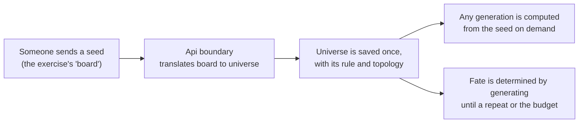
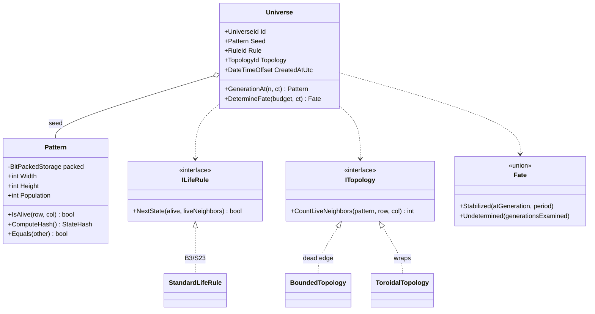
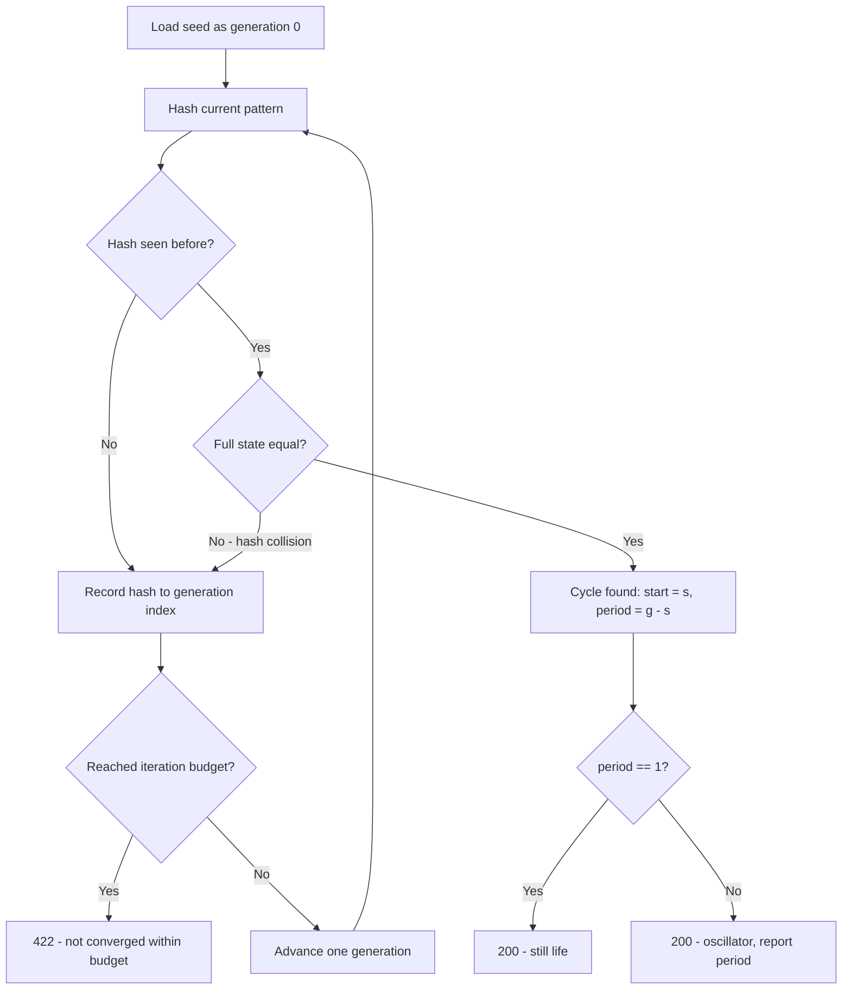
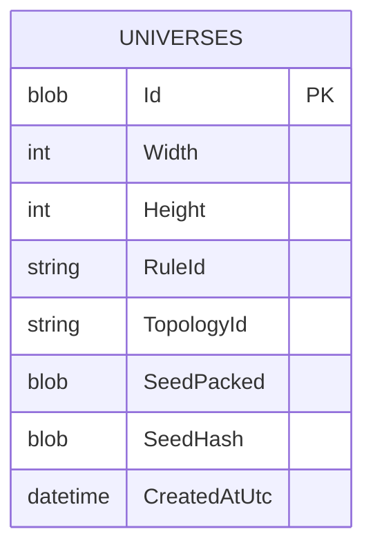
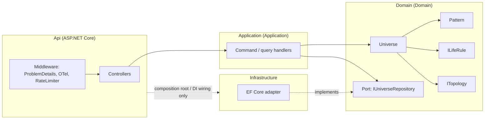
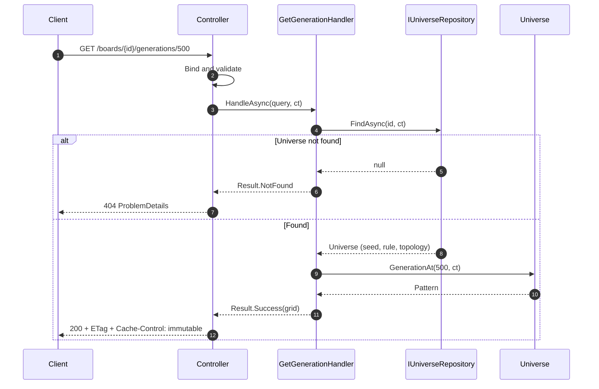
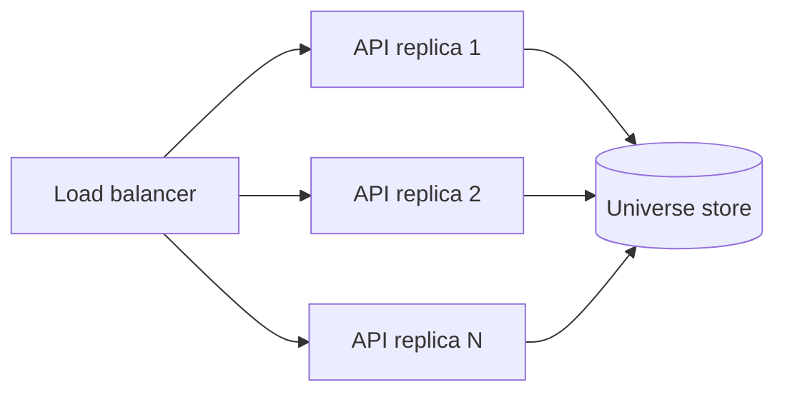
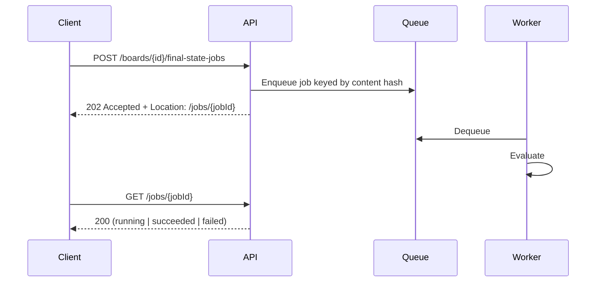

# Conway's Game of Life API: Design Document

**Status:** Draft for review
**Target:** C# / .NET 8 (`net8.0`)
**Author:** Nick Simmons

---

## 1. Begin with a story: a glider's short life

This API is for people exploring Conway's Game of Life. So the starting point is not a database table or an endpoint. It is the small, surprising thing shown in the [introduction to the Game of Life](https://www.youtube.com/watch?v=ouipbDkwHWA&t=5s): five cells that appear to fly.

### 1.1 The story

Picture a glider. Five live cells in a loose arrowhead, sitting in an otherwise empty universe. The glider has no idea it is a glider. It has no idea it is a spaceship, or that anything is about to happen to it at all. It is just five cells, and each of them knows exactly one thing: how many of its eight neighbours are alive.

Then the clock ticks. Every cell in the universe, all at the same instant, looks at its neighbours and follows three rules. A live cell with two or three live neighbours survives. A live cell with fewer or more than that dies. A dead cell with exactly three live neighbours is born. Nobody coordinates this. Nobody moves anything. Each cell attends only to its own small patch of the universe.

After the first tick the glider looks different, slightly askew. After the second, different again. After the fourth tick it is back to its original shape, except that it now sits one cell down and one cell to the right of where it started. It has travelled. It will do the same thing every four ticks for as long as the universe lets it, and it never once decided to.

That is what Life practitioners mean by a spaceship: a pattern that reappears with its original shape in a new place. The glider is the smallest one. The word describes something we noticed by watching. It is not something the glider carries, and not something we could have known by looking at the five cells before the first tick.

Eventually the glider reaches the edge of its universe, and here the story has two endings. If the universe simply stops at the edge, so that everything beyond it counts as dead, the glider loses the neighbours it needs, breaks apart, and is gone within a few ticks. If the universe instead wraps, so that the right edge joins the left and the top joins the bottom, the glider sails off one side and reappears on the other, and it will orbit forever. Same five cells. Same rules. Different universe, different fate.

### 1.2 What someone wants to ask

Somebody watching this wants to keep the glider. Not the whole flight, just the starting arrangement, the rules, and the shape of the universe it flew in. Given those three things, every tick that follows is determined; there is nothing else the flight could have depended on. Keeping the starting point *is* keeping the flight.

Then they want to ask questions of it. What does the glider look like after the next tick? After the hundredth? Does it settle into something still, or repeat, or is it still doing something new for longer than anyone is willing to wait?

Notice what they do not want. They do not want to *move* the glider forward and then ask where it is, because then two people asking at different times get different answers about the same glider. They want to ask about tick 100 today and get the same answer tomorrow.

### 1.3 Modelling the domain

The language above is not decorative. It is the domain, and the model should use it rather than translate it into something more generic.

The Game of Life literature already has a settled vocabulary, and this design adopts it directly rather than inventing friendlier synonyms. The thing the glider lives in is a **universe**, which is Wikipedia's own word for it. The five-cell arrowhead, and every subsequent arrangement of live and dead cells, is a **pattern**. The particular pattern you start with is the **seed**. Each tick produces a new **generation**. The three rules together are the **rule**, written B3/S23 in the standard notation. What happens at the edge is the universe's **topology**, which is the word Golly uses when it offers a plane, a cylinder, a torus, or a Möbius strip. And what a pattern eventually does, whether it dies, freezes, or repeats, is its **fate**, which is the word Conway himself used when tracking small patterns by hand.

Spaceship, still life, oscillator, and glider are also domain words, but of a different kind. They classify a pattern by its *behaviour*, and behaviour is something you discover by generating and watching. So they appear in this design as observations and as test cases, never as fields. There is no `IsSpaceship` flag anywhere, for the same reason the glider itself does not know it is one. "Glider" is a description at a different level than the cells: fully determined by them, useful precisely because it compresses them, and nothing over and above them. Keeping the two levels apart in the model is a principled choice rather than an aesthetic one (Dennett's "Real Patterns" makes this argument using Life itself).

Some of those words are technical. "Topology" in particular is a mathematician's term. But it is the domain's own technical term, and the point of ubiquitous language is to adopt the vocabulary the practitioners use rather than to replace it with something that sounds friendlier and means slightly less.

#### What the exercise calls it

The exercise talks about a **board**, and its HTTP routes should too, because that is the contract the reviewer will test against. Inside the domain, though, "board" does not appear. A board is what the outside world sends; a universe is what we keep. The web layer translates one to the other at the boundary and does not let the outer word leak in.

That translation is the only place where two vocabularies genuinely meet, and it is worth naming for what it is: a context boundary. The exercise has its own small language (board, cells, next, final) and the Life domain has its own (universe, seed, pattern, generation, fate). Each is internally consistent. They should not be merged, and one should not be allowed to rename the other.

#### On bounded contexts

I want to be careful here, because it is easy to call a layer a bounded context and thereby claim more than is true.

A bounded context is a boundary within which a term has one meaning. It earns the name when the same word means different things on either side, or when two groups of people describe the same thing in different words. By that test there is exactly one such boundary in this system today: the one just described, between the exercise's contract and the Life domain. "Board" on one side, "universe" on the other, and an explicit translation between them.

What there is *not* is a second context for storage. Saving a universe and evolving a universe use the same model of what a universe is, so splitting them would be a layer boundary wearing a bounded-context costume. The repository is a port *within* the Life context, expressed in the Life context's language, and it stores exactly one kind of thing. That is why it is `IUniverseRepository` rather than `IRepository<T>`: the generic form would suggest this application stores arbitrary things, and it does not. It stores universes.

There is one plausible future context, and naming it clarifies where the seam would fall. The Life community keeps a **pattern catalogue**: named patterns like Glider, Acorn, and Gosper glider gun, each with a discoverer, a year, and a standard interchange format. In a catalogue, a "pattern" carries provenance and a name. In evolution, a "pattern" is just cells. Same word, two meanings, which is the actual signal for a second context. Nothing in the exercise asks for it, so it is not built. But if it were, that is where the line goes.

### 1.4 High-level approach

The story implies the shape of the system directly.



A universe is saved exactly once, at the moment its seed arrives, and it is never changed afterwards. When someone asks for generation 100, the system starts from the seed and applies the rule 100 times. It does not remember generation 100, and it does not promote it to a new current state. The next generation is the same question with the number 1.

Asking for a pattern's fate means generating until either a pattern reappears, which is a cycle, or a budget is exhausted, in which case the honest answer is that the fate is undetermined within that budget rather than that the pattern never settles. Every finite universe settles eventually; the budget is a statement about our patience, not about the universe.

The topology and the rule are part of what gets saved, because they are part of what makes the flight what it is. The first release uses a bounded universe with a dead edge, since that is the literal reading of "upload a 2D grid," and a wrapping universe is a named alternative rather than a rewrite.

### 1.5 High-level implementation

Following the arrows left to right:

1. The web layer accepts the exercise's `board` representation, validates it, and hands a seed to a command handler.
2. The handler constructs a `Universe` from the seed, the standard rule, and the bounded topology, and asks `IUniverseRepository` to add it. The universe receives an identity at this point and never changes again.
3. A generation request finds the universe by identity and asks it for `GenerationAt(n)`, which returns a `Pattern`.
4. To produce that pattern, the universe applies the rule to every cell of the previous generation simultaneously. Each cell reads only its neighbours' previous state, never their new one; the order in which cells are visited must not matter.
5. A fate request asks the universe to `DetermineFate(budget)`, which generates while remembering what it has seen, and returns either the generation at which a cycle began and its period, or a statement that the budget was exhausted.
6. The web layer maps the result back into the exercise's vocabulary and status codes.

Nothing in steps 2 through 5 knows that HTTP exists or that a database exists. The domain model is plain code that can be exercised in a unit test with a seed and a number.

### 1.6 Why these choices follow from the story

Rather than a table of decisions, here is the reasoning as a chain, because each step depends on the one before.

The glider's flight is determined entirely by its seed, its rule, and its topology. So those three things are what we keep, and nothing else needs to be. That is the immutable-universe decision, and it is a consequence of how Life works rather than a preference about how to build software.

Because the universe is immutable, every question about it has one answer forever. So generations are computed rather than stored, responses can be cached without any invalidation, no two requests ever contend for the same state, and any replica can answer any question. Most of the concurrency and scaling design in later sections is simply this consequence, spelled out.

Because "spaceship" is something we notice rather than something the glider carries, the model holds facts and lets behaviour emerge. That is what keeps `Pattern` a plain value with no classification baked in, and it is why the test suite is built from published patterns whose behaviour is known: the tests check that the right behaviour emerges from the right seed, which is the only kind of correctness this domain has.

Because the edge of the universe changes the glider's fate, topology is part of the universe rather than a global setting. Two universes with the same seed and different topologies are different universes, and the model says so.

Because the exercise speaks of boards and the domain speaks of universes, and neither vocabulary should bend to the other, translation happens once at the boundary. That is the single bounded-context seam, and it is the reason the repository is named for what it stores rather than made generic.

The rest of this document is the detailed design behind those decisions. It separates the durable choices from the implementations that currently serve them, records rejected alternatives, and makes explicit what is not being built.

---

## 2. Requirements & interpretation

### 2.1 Functional (from the exercise)

| # | Requirement | Endpoint |
|---|---|---|
| 1 | Upload board state, return unique id | `POST /api/v1/boards` |
| 2 | Get next generation for a board | `GET /api/v1/boards/{id}/next` |
| 3 | Get state N generations ahead | `GET /api/v1/boards/{id}/generations/{n}` |
| 4 | Get final stable state, or a suitable error | `GET /api/v1/boards/{id}/final` |

### 2.2 Non-functional

- Board states survive process restart or crash.
- Clean, modular, testable; proper error handling and validation.
- Follows C# and .NET best practices.
- No authentication or authorization required.

### 2.3 Ambiguities in the prompt, and how they were resolved

The prompt leaves four things undefined. Each materially changes the design, so each is resolved explicitly rather than implicitly.

| Ambiguity | Resolution | Section |
|---|---|---|
| Is a universe mutable (does it "advance"), or is its seed fixed? | **Immutable seed.** Generations are computed, never stored. | [§3](#3-the-governing-insight-determinism) |
| What happens at the grid edge? | **Bounded universe, dead edge** by default; topology is a strategy. | [§4.3](#43-topology-and-why-it-decides-fate) |
| What does "final stable state" mean for an oscillator? | Detect **any cycle**; report `period` (1 = still life). | [§6](#6-final-state-resolution) |
| What is a "reasonable number of iterations"? | Configurable budget; exceeding it is `422`, not `500`. | [§6.3](#63-the-non-convergence-contract) |

---

## 3. The governing insight: determinism

> Generation *N* of a Game of Life universe is a pure, deterministic function of its seed, its rule, and its topology. Nothing else is input. There is no randomness, no clock, no external state.

I tend to think this single property, taken seriously, decides most of the architecture. If a universe is modelled as an immutable seed and every generation as a computation from that seed, a surprising amount falls out for free.

Every read endpoint becomes a pure `GET`: idempotent, safely retryable, free of side effects. Responses become permanently cacheable, and not as an optimisation bolted on afterwards; `ETag` with `Cache-Control: public, immutable` is correct by construction, because a given generation's content can never change. There is no shared mutable state on the request path, so there is no locking problem to solve at all, and concurrency control collapses into a question about CPU admission rather than correctness. Durable state is write-once, which means no partial updates, no torn writes, and no update migrations, so crash safety stops being much of a design problem. And horizontal scale needs no coordination, since any node can serve any request given only the seed, with the single caveat that the universe store has to permit it ([§7.3](#73-store-choice)).

That last consequence matters more than it first appears. It is the reason [§8.3](#83-service-boundaries) concludes this service does not yet need a queue or a separate worker tier.

### 3.1 The rejected alternative

The obvious alternative is a mutable universe holding a "current generation" that `POST /boards/{id}/next` advances.

As far as I can tell it is worse on every axis. Advancing becomes a non-idempotent write, which forces optimistic concurrency (`If-Match` or version columns) and 409-conflict handling. Responses stop being cacheable. "Get N ahead" turns ambiguous, since N is now relative to whatever the current generation happens to be. And crash safety becomes a real problem rather than a non-problem.

To be sure, I'm not saying a mutable model is never right. If the universe were a shared artifact that several clients edited collaboratively, it plainly would be. It just isn't that here, and it buys nothing in exchange for those costs.

### 3.2 A precise statement about termination

A finite $w \times h$ grid has exactly $2^{w \cdot h}$ possible states. Evolution is deterministic, so the sequence of states is eventually periodic: by the pigeonhole principle, every finite universe must eventually cycle. Termination is guaranteed in theory.

So the error case in requirement 4 is not "this pattern never stabilizes." It is precisely "this pattern's fate was not determined within our iteration budget." The API says exactly that, and reports how many generations it examined. That distinction drives the status-code choice in [§6.3](#63-the-non-convergence-contract).

---

## 4. Domain model

Everything in this section lives in the Life context described in [§1.3](#13-modelling-the-domain), and uses its vocabulary. The exercise's word "board" does not appear below this line except when quoting the HTTP contract.

### 4.1 Model



`Universe` is the aggregate. It owns a seed, a rule, and a topology, and it answers two questions: what does generation N look like, and what is this pattern's fate. `Pattern` is a value object for one arrangement of cells, whether that is the seed or generation ten thousand. `Fate` is the result of a search, and its two cases are the two honest answers that search can give.

A still life is a `Stabilized` fate with a period of one. The literature treats still lifes and oscillators as different kinds of thing, and the API response reports the period so a client can make that distinction, but the model does not need two cases for what is arithmetically one.

### 4.2 Pattern, rather than raw indexing

`Pattern` is the domain's name for an arrangement of cells. Its current storage is bit-packed in a `ulong[]` rather than a `bool[,]`. That buys three things: roughly 64 times less memory, which matters because seeds get serialized and persisted; cheap hashing for cycle detection, since hashing becomes a pass over the backing array rather than a nested loop; and room to vectorise neighbour counting later without disturbing the public surface.

The bit manipulation is fully encapsulated. Consumers see `IsAlive(row, col)`, `Width`, `Height`, and `Population`, and no caller ever computes an offset. `Pattern` is a value object: immutable, structurally equal, no identity.

### 4.3 Topology, and why it decides fate

The story in [§1.1](#11-the-story) ended two ways, and the difference was the edge of the universe. That is not a detail. It determines whether a pattern stabilizes at all.

On a bounded universe with a dead edge, a glider reaching the boundary loses the neighbours it needs and breaks apart, so most patterns settle fairly quickly. On a torus, that same glider wraps and orbits indefinitely, which guarantees a long cycle rather than a still life. Same seed, same rule, different fate.

Bounded is the default, since it matches the literal reading of "upload a 2D grid." Modelling the choice as `ITopology` rather than hard-coding it makes the torus a strategy swap rather than a rewrite. The same applies to `ILifeRule`: the standard rule is B3/S23, and HighLife (B36/S23) becomes configuration rather than code.

These are the only two extensibility seams in the domain, and I think they earn their place. Both are variation axes named in the source material rather than ones I invented, and topology is load-bearing for requirement 4 rather than decorative. [§9](#9-decisions-versus-implementations) applies the same test to everything else, and one candidate seam does not survive it.

---

## 5. API design

### 5.1 Resource model

HTTP keeps the exercise's word **board**, because that is the contract under test. It is the delivery name for a `Universe`, translated at the boundary as [§1.3](#13-modelling-the-domain) describes; the transport vocabulary does not rename the domain. Generations are sub-resources addressed by index.

| Method | Route | Purpose | Success |
|---|---|---|---|
| `POST` | `/api/v1/boards` | Save a seed, mint id | `201` + `Location` |
| `GET` | `/api/v1/boards/{id}` | Universe metadata and seed | `200` |
| `GET` | `/api/v1/boards/{id}/generations/{n}` | Pattern at generation N | `200` |
| `GET` | `/api/v1/boards/{id}/next` | Alias for `generations/1` | `200` |
| `GET` | `/api/v1/boards/{id}/final` | Fate, if determined within budget | `200` or `422` |

**On `POST` versus `PUT` for upload:** `POST`. The server mints the identifier, so the client cannot know the target URI in advance, which is the standard case for `POST`. `PUT` would imply a client-chosen id and an idempotent replace, and since seeds are write-once there is nothing to replace.

**On the `/next` alias:** under the immutable model, `next` is exactly `generations/1`. The alias exists so the delivered API maps cleanly onto the four bullets in the exercise, and it shares an implementation with the indexed route. It is a deliberate concession to the reader, and I'd drop it without much hesitation if the uniform model were the only audience.

### 5.2 Versioning

URL-segment versioning (`/api/v1/...`). Chosen over header or query-string versioning because it is visible in logs, traces, and cache keys, and it makes the routing table self-documenting. The version segment is present from day one so that adding `v2` is never a breaking restructure.

### 5.3 Representations

Request, using the spec-literal 2D array:

```json
{ "cells": [[0,1,0],
            [0,1,0],
            [0,1,0]] }
```

Response:

```json
{
  "boardId": "0b5f...",
  "generation": 1,
  "width": 3,
  "height": 3,
  "population": 3,
  "cells": [[0,0,0],
            [1,1,1],
            [0,0,0]],
  "_links": {
    "self":  "/api/v1/boards/0b5f.../generations/1",
    "next":  "/api/v1/boards/0b5f.../generations/2",
    "final": "/api/v1/boards/0b5f.../final",
    "board": "/api/v1/boards/0b5f..."
  }
}
```

### 5.4 On HATEOAS and the N+1 concern

Full HATEOAS, meaning a hypermedia format such as HAL or JSON:API with client-driven navigation, is not implemented. For five endpoints with no workflow state, it would be ceremony without a payoff.

A small `_links` block is included, though, because it seems to me to earn its keep: it communicates that generations form a walkable sequence, and it hands the client the `final` affordance without out-of-band knowledge.

The N+1 risk I noted while planning turns out not to apply here, because links are generated from route templates rather than from data. Building `_links` performs no additional queries and no additional lookups. The N+1 problem in hypermedia APIs comes from resolving related entities in order to build links, and there are no related entities to resolve.

### 5.5 Caching

Because a generation's content is immutable, the caching story is stronger than it usually gets to be:

```
ETag: "sha256-<state-hash>"
Cache-Control: public, max-age=31536000, immutable
```

`If-None-Match` is honoured and returns `304`. This follows directly from [§3](#3-the-governing-insight-determinism), and it is correct without any invalidation strategy, because nothing exists that could invalidate it.

The `final` resource is not marked immutable, since its result depends on the configured iteration budget, and that is a server-side setting which can change.

---

## 6. Final-state resolution

### 6.1 Algorithm

Walk generations, hashing each state and recording the hash against its generation index. A repeated hash means a cycle, subject to collision verification.



### 6.2 Why a hash map, and why verify on hit

Three approaches were considered:

| Approach | Memory | Compute | Gives cycle start? |
|---|---|---|---|
| Store every full state | O(g · w · h) | O(g) | Yes |
| **Hash to generation index** | O(g) | O(g) | **Yes** |
| Floyd / Brent cycle detection | O(1) | 2 to 3x | Only with a second pass |

The hash map wins on the combination that matters here. It finds the cycle start in a single pass, which Floyd does not, and its memory scales with the generation count rather than with the grid area. Floyd's constant-memory property is attractive, but the budget already bounds the generation count, so the memory it saves is bounded anyway.

Collision verification is not optional. A hash hit is treated as a candidate only, and the full grid is compared before declaring a cycle. Skipping that step would mean a hash collision silently produces a wrong answer, which is the kind of correctness bug tests almost never catch, because it depends on hitting a specific collision. The cost is one comparison per candidate, and candidates are rare, so this is close to free.

Only the hashes are retained during the walk, not the states. On a hash hit, the candidate generation is recomputed from the seed and compared. That trade matters more than it sounds: retaining every state for direct comparison would cost roughly 40 MB per in-flight request at the caps in [§10.1](#101-validation-and-input-bounds), and several hundred megabytes once admission control allows one evaluation per core. Retaining hashes alone costs a few hundred kilobytes. Since a 128-bit collision is vanishingly unlikely, the recomputation almost never happens, so its cost is amortised to nothing.

### 6.3 The non-convergence contract

Per [§3.2](#32-a-precise-statement-about-termination), non-convergence is a statement about *our budget*, not about the board. The response says so:

```
HTTP/1.1 422 Unprocessable Content
Content-Type: application/problem+json
```
```json
{
  "type": "https://conways-api/problems/not-converged",
  "title": "Board did not converge within the iteration budget",
  "status": 422,
  "detail": "Examined 5000 generations without detecting a cycle. Every finite board is eventually periodic; this board's period exceeds the configured budget.",
  "boardId": "0b5f...",
  "iterationsExamined": 5000
}
```

`422` rather than `400`, since the request was well-formed and valid; rather than `500`, since nothing failed; and rather than `200` with a null body, which would leave the client guessing. `404` stays reserved for an unknown board id.

The alternative considered was `200` carrying an explicit `"converged": false`, on the argument that a client treating every 4xx as its own bug is poorly served here. I decided against it. Non-convergence means the server could not produce the requested representation, and encoding that as a success status pushes the failure into the body, where a generic client has no reason to look. `422` is specifically the status for a request that is syntactically valid and semantically understood but still unprocessable, which is exactly this case. Keeping the distinction in the status line also keeps it visible to proxies, dashboards, and alerting without anyone having to inspect a body.

### 6.4 Test oracles

The published Life literature supplies exact, non-trivial expected values, which make good regression tests precisely because they fail loudly on any off-by-one in neighbour counting or any accidental in-place update.

| Pattern | Expected behaviour | Valid on a bounded grid? |
|---|---|---|
| Block | Still life, period 1 | Yes |
| Blinker / Toad / Beacon | Oscillator, period 2 | Yes |
| Pulsar | Oscillator, period 3 | Yes |
| Penta-decathlon | Oscillator, period 15 | Yes |
| Diehard | Dies completely after 130 generations | Yes, given adequate margin |
| Glider | Translates (1,1) every 4 generations | Only while clear of the border |
| R-pentomino | Stabilises after 1103 generations | No |
| Acorn | 5206 generations, 633 cells | No |

That last column is a correction I owe an earlier draft of this document, which listed all eight as though they were interchangeable. The published figures are for an unbounded grid. R-pentomino and Acorn both emit escaping gliders, and on a bounded grid those gliders die at the border rather than departing forever, so the stabilisation generation is not necessarily the published one. On a torus they wrap and collide with the remaining ash, which is different again.

So R-pentomino and Acorn are used as methuselah tests that assert convergence happens and is deterministic, rather than as assertions about a specific generation number. I'd rather ship a weaker assertion that is true than a precise one that only holds on a grid this API does not offer. The glider test asserts translation only across the generations where it stays clear of the edge.

Acorn earns its place for a second reason. At 5206 generations it exceeds the default convergence budget in [§10.4](#104-configuration), so it exercises the `422` path from [§6.3](#63-the-non-convergence-contract) without needing a contrived input.

The "NaiveLife" failure mode, where cells are updated in reading order so a cell sees its neighbours' new states rather than their previous ones, is the most common implementation bug in this problem. Blinker and Glider both catch it immediately.

---

## 7. Persistence: saving universes

### 7.1 What must be durable

Only the **seed**, together with the rule and topology that make it replayable. Everything else is derivable. This is what makes the crash-safety requirement nearly free: the durable write happens once, when the seed arrives, and is never mutated.

### 7.2 Schema



One table, holding one kind of thing. That is the entire persistence model, and it is worth pausing on, because an earlier draft of this document had two.

The second was `GENERATION_SNAPSHOTS`, a checkpoint cache holding periodically materialised generations so a request for generation 500 could resume from 448 rather than replaying from the seed. I cut it; the reasoning is in [§12](#12-deliberately-not-built), but the short version is that it memoises repeat cost without bounding worst-case cost, and bounding worst-case cost was the actual requirement.

Reads are therefore a single point lookup by primary key. No join, no range scan, no secondary index, because no query needs one. I mention the absence mainly to make clear it is deliberate rather than overlooked.

### 7.3 Store choice

The instinct is to choose a store based on the read/write mix, so it is worth establishing that mix first. This workload is write-once-read-many, and lopsidedly so.

A board is inserted exactly once and then never updated or deleted. Every subsequent request is a point lookup of that one row by primary key, returning an immutable blob. There is no update, no delete, no range scan, no join, no aggregate, no secondary index, and no transaction spanning more than a single row. And because generations are immutable, HTTP caching ([§5.5](#55-caching)) absorbs most repeat reads before they reach the database at all.

So the honest conclusion is that the read/write mix is the wrong axis for this decision, because almost nothing that distinguishes PostgreSQL from SQLite is in play. MVCC matters under concurrent read/write contention, and nothing here ever contends, since nothing is ever updated. A sophisticated planner matters when there are plans to choose between, and there is exactly one. Vacuum and bloat management matter when dead tuples accumulate, and an insert-only table produces none. Richer index types matter when a query needs them, and no query does.

#### The axis that actually decides it

Deployment topology, not workload shape.

SQLite is a local file, which makes the process stateful. That sits directly against the claim in [§3](#3-the-governing-insight-determinism) that horizontal scale needs no coordination, and against the multi-replica topology drawn in [§8.3](#83-service-boundaries). Two API replicas cannot safely share a SQLite file, and putting one on a network filesystem invites lock-related corruption rather than solving anything. SQLite also serialises writers, so concurrent uploads queue behind one another even in WAL mode.

Put plainly: the universe store is the one component in this design preventing the scale-out story from being literally true. Everything else really is stateless. I'd rather state that than let it sit as an unexamined contradiction between two sections.

#### Where that lands

SQLite stays the default. A reviewer can clone the repository and run `dotnet run` with no prerequisites, and durability, which is the actual stated requirement, is fully satisfied by it. The EF Core `InMemory` provider is disqualified outright for the opposite reason: it cannot demonstrate durability at all.

Postgres ships as a compose profile rather than as a footnote, and the same integration suite runs against both providers. That is deliberate. Running the tests against two providers demonstrates that the port in [§7.4](#74-a-repository-for-universes-not-for-everything) actually holds, rather than merely asserting that it would.

The trigger for making Postgres the default is the same trigger as scaling past one replica, and I'd make the switch at that point rather than in advance. Until then, putting Postgres underneath a single-table, single-query, insert-only schema would be production fidelity in name only.

### 7.4 A repository for universes, not for everything

EF Core's `DbSet<T>` is already a repository and `DbContext` is already a unit of work. Wrapping them in a generic `IRepository<T>` that forwards `IQueryable` adds indirection and leaks the persistence model upward. It also loses the domain's language: this application stores universes, not arbitrary `T`s, and the port should say so.

What is defined instead is a port, not a wrapper:

```csharp
// Domain: expressed entirely in the Life domain's terms
public interface IUniverseRepository
{
    Task<Universe?> FindAsync(UniverseId id, CancellationToken ct);
    Task AddAsync(Universe universe, CancellationToken ct);
}
```

No `IQueryable`, no `Expression<Func<T,bool>>`, and no `SaveChanges` leaking across the boundary. The interface exposes only what the domain actually needs. The EF implementation lives in Infrastructure and is the only code that knows SQL exists. That satisfies dependency inversion without reintroducing the generic-repository smell.

I'd add one thing to the usual argument against generic repositories. They are not just leaky; they are *uninformative*. `IRepository<Universe>` tells a reader that some storage exists. `IUniverseRepository` with two methods tells a reader that this application keeps exactly one kind of thing, finds it by identity, adds it once, and never updates or deletes it. The second interface is documentation of the domain's access pattern. The first is a template.

---

## 8. Architecture

### 8.1 Layers and the dependency rule

Four projects. Dependencies point **inward only**.



| Project | Responsibility | May reference |
|---|---|---|
| `Domain` | Entities, value objects, rules, ports. Zero infrastructure dependencies | Nothing |
| `Application` | Handlers orchestrating domain and ports. Returns `Result<T>` | `Domain` |
| `Infrastructure` | EF Core adapter implementing the Domain port | `Domain` |
| `Api` | Controllers, serialisation, middleware, composition root | `Domain`, `Application`, `Infrastructure` |

The one inward-violating arrow, `Api` to `Infrastructure`, exists solely so the composition root can register implementations. No Api code calls an Infrastructure type directly.

This is enforced rather than merely documented. An architecture test asserts the dependency rule, so a violation fails the build instead of surviving review.

### 8.2 Request flow



The controller does three things and nothing else: bind and validate, send, and map the `Result<T>` onto a status code. Note also that the `GET` writes nothing. An earlier draft had it persisting a checkpoint on the way out, which quietly made a read endpoint into a writer; [§12](#12-deliberately-not-built) covers why that went away.

### 8.3 Service boundaries

This deserves treating as a first-class question rather than something implied by the project layout. Today there is exactly one deployable: the web tier and the evaluation work run in the same stateless process, scaled horizontally behind a load balancer.



The obvious alternative is a web tier that accepts requests and a pool of worker nodes that compute, decoupled by a queue. I don't think that's right yet, and the reason is worth stating carefully, because reaching for a queue is close to a reflex.

Queues buy decoupling in time, backpressure, and failure isolation. Those are real benefits when producer and consumer have different availability requirements, different scaling profiles, or when the work has side effects that must not be lost. Evolution has none of those properties. It is a pure function of `(seed, rule, topology, n)`. It has no side effects, needs no coordination, and can be recomputed anywhere at any time. That is precisely the workload that gains least from decoupling, because there is nothing to decouple from.

The costs, meanwhile, are concrete: a second deployable, job identity and state, a polling or callback protocol, at-least-once delivery semantics, idempotency handling, dead-letter management, and a second failure surface. For a function of a blob and an integer that currently completes in bounded time, that trade looks clearly bad to me.

#### Where the seam actually is

The boundary is still worth defining even though nothing crosses it yet, because defining it is what keeps the option cheap.

The seam is the evaluation request: `(seed, rule, topology, target)` to a pattern. Today the handler satisfies that in-process by calling the domain. Whether it is satisfied in-process or by a remote worker is an infrastructure concern, and the domain holds no opinion about it. Nothing in `Domain` or `Application` would change if the answer arrived over a queue rather than a stack frame.

#### What would trigger a split, and what would split first

The two read endpoints are not symmetric, and I think that asymmetry is the crux:

- **Generation N is bounded by construction.** Work is at most `n_max · w · h`, and all three are capped, so the worst case is known before the request runs.
- **Final state is an unbounded search.** You cannot know a pattern's period in advance. All you know is that you will stop at the budget.

So `final` is the endpoint that outgrows request/response first, and it should split alone. Generation N can stay synchronous indefinitely, because bounding the input bounds the work. Splitting both would be symmetry for its own sake.

The trigger is specific: when the convergence budget has to rise far enough that a cold `final` evaluation no longer fits comfortably inside an HTTP request. At that point `final` becomes `POST /boards/{id}/final-state-jobs` returning `202` with a `Location`, and a worker pool consumes the queue. [§13.1](#131-when-the-synchronous-final-state-stops-being-enough) has the shape.

#### What immutability buys the queued version

When that split does happen, the immutable seed pays off a third time. Jobs are pure, so at-least-once delivery is harmless and retries need no compensating action. Results are content-addressable, since the answer for a given `(seedHash, ruleId, topologyId, target)` is always identical, which supplies a natural deduplication key and makes a duplicated job a waste of CPU rather than a correctness problem. And workers share no state, so the pool scales on queue depth with no rebalancing.

I'd rather establish those properties before introducing the queue than after. The hard part of queue-based work is almost never the queue; it's discovering afterwards that the job wasn't idempotent and the retry path is now the most delicate code in the system.

### 8.4 Concurrency and CPU admission

Computing N generations is O(N · w · h) and CPU-bound, which shapes the async posture.

The evolution core is synchronous. Wrapping pure CPU work in `Task.Run` or returning a fake `Task` would move work onto a thread-pool thread without adding any concurrency, and under load that starves the pool rather than helping it. Database I/O is genuinely async, with `CancellationToken` threaded from `HttpContext.RequestAborted` so an abandoned request stops burning CPU promptly.

Admission is bounded by a `SemaphoreSlim` sized from `Environment.ProcessorCount`, so a burst of expensive requests cannot occupy every core. Requests that fail to acquire a slot within a short timeout get `503` with `Retry-After`, which I prefer to unbounded queueing; a request that will be answered too late to be useful is better refused quickly. ASP.NET Core's built-in rate limiter provides the outer bound.

There is no lock anywhere, because there is no shared mutable state, which is a direct dividend of [§3](#3-the-governing-insight-determinism).

One clarification, since an earlier draft blurred it. Admission control and the input caps in [§10.1](#101-validation-and-input-bounds) solve different problems. Caps bound the cost of a single request. Admission bounds how many expensive requests run concurrently. Neither substitutes for the other, and a design with only admission control still permits one request to monopolise a core for as long as its input allows.

---

## 9. Decisions versus implementations

A recurring failure mode in design documents is stating a library choice as though it were an architectural commitment. The two have very different half-lives, and conflating them makes the durable decisions look negotiable and the swappable ones look sacred. So they are separated here.

| Concern | Architectural decision (durable) | Current implementation (swappable) | What would change the implementation |
|---|---|---|---|
| Use-case dispatch | Api depends on an abstraction, not on concrete handlers | Four hand-rolled interfaces, injected as closed generics | The first real cross-cutting concern, which makes a pipeline worth having |
| Expected failures | Modelled as values, not exceptions | `Result<T>` | .NET gaining real discriminated unions |
| Durability | Write-once universe in a durable store | EF Core + SQLite | Scaling past one replica ([§7.3](#73-store-choice)), or a move to DynamoDB |
| Evolution rule | Strategy, not hard-coded | `StandardLifeRule` (B3/S23) | Supporting HighLife or another Life-like rule |
| Topology | Strategy, not hard-coded | `BoundedTopology` | A toroidal requirement |
| Admission | Bounded concurrency with explicit rejection | `SemaphoreSlim` plus rate limiter | Queue-based backpressure |
| Evaluation location | Behind a request abstraction | In-process and synchronous | `final` outgrowing request/response ([§8.3](#83-service-boundaries)) |
| Telemetry | Vendor-neutral instrumentation | OpenTelemetry and Serilog | An exporter change, nothing more |

### 9.1 Use-case dispatch: no library

Controllers are thin by deliberate construction: bind and validate the request, hand off to a handler, map the resulting `Result<T>` onto a status code. No business logic, no data access, no orchestration.

The architectural commitment is that `Api` depends on an abstraction rather than on concrete handler classes. A mediator library is one way to satisfy that. It is not the only way, and here it is not the one chosen.

#### The shape

Four small interfaces in `Application`, with no package reference behind them:

```csharp
public interface ICommand { }

public interface IQuery<TResult> { }

public interface ICommandHandler<TCommand> where TCommand : ICommand
{
    Task<Result> HandleAsync(TCommand command, CancellationToken ct);
}

public interface IQueryHandler<TQuery, TResult> where TQuery : IQuery<TResult>
{
    Task<Result<TResult>> HandleAsync(TQuery query, CancellationToken ct);
}
```

A controller takes the closed generics it needs:

```csharp
public BoardsController(
    ICommandHandler<CreateBoardCommand> createBoard,
    IQueryHandler<GetGenerationQuery, GenerationView> getGeneration)
```

That is the whole mechanism. The `IQuery<TResult>` marker is doing real work rather than decorating: the constraint on `IQueryHandler` is what prevents a handler being registered with a result type that does not match its query.

#### Why not a runtime dispatcher

It is tempting to add a `Send(request)` entry point that discovers the handler from the request type, and `Activator.CreateInstance` is the usual first reach for that. I'd avoid it here, for three reasons.

It bypasses dependency injection. A handler constructed by `Activator` receives none of its dependencies, so the repository and logger have to be resolved or passed by hand, which works against the container rather than with it.

It moves failures from build time to request time. With closed generics injected through the constructor, a missing registration is caught by `ServiceProviderOptions.ValidateOnBuild` and the process fails at startup. A reflective dispatcher finds the same mistake when a user hits the endpoint.

And it discards the type checking that makes the marker interfaces worth having. Reflection hands back `object`, so the constraint tying `TQuery` to `TResult` stops being enforced at exactly the point it was introduced to help.

If a single dispatch point were genuinely wanted later, the right tool would be `IServiceProvider.GetRequiredService<IQueryHandler<TQuery, TResult>>()` rather than `Activator`, since that at least keeps the container involved. But that is a service locator, and at four endpoints constructor injection is both simpler and safer.

#### What this gives up

A pipeline. Cross-cutting behaviour that a mediator would supply through behaviours has to live somewhere else: validation stays at the Api boundary ([§10.1](#101-validation-and-input-bounds)), and logging and tracing go in middleware, which is where ASP.NET Core already puts them.

That trade only works because nothing repeats across handlers yet. The trigger for revisiting is in [§9.2](#92-minimal-now-with-a-defined-path): once handlers start duplicating a concern, a pipeline earns its place, and at that point adopting a library is a better answer than slowly growing one.

#### The alternatives, and why they lost

Licensing across this category has shifted recently, so treat the licensing notes as prompts to verify rather than as settled fact.

| Option | Why it might have won | Why not |
|---|---|---|
| **MediatR 12.x** | Universally recognised; a reader sees `Send` and knows what it does | The pipeline is the main thing it adds over a constructor parameter, and there is no pipeline here. Later majors also moved to commercial licensing |
| **Wolverine** | In-process dispatch and queued messaging are the same model, with a durable outbox included | Considerably more machinery than four endpoints justify, and JasperFx licensing needs checking |
| **Brighter + Darker** | The explicit command and query split is clean, and mirrors the split above | Two libraries and a heavier pipeline for one command and three queries |
| **Cortex.Mediator** | Close to drop-in if licensing were the only objection | Young and small, so it trades a licensing question for a bus-factor one |

Wolverine stays the named successor, and for the same reason as before: at the [§8.3](#83-service-boundaries) `final` split, the dispatcher and the message bus want to be one abstraction, so moving a handler from in-process to queued becomes a transport change rather than a rewrite. Brighter and Darker would suit a team already standardised on them, and I'd treat that as a house-style question more than a technical one.

To be clear about the shape of this argument, I'm not claiming mediator libraries are bad. MediatR earns its keep in codebases with real pipeline requirements and dozens of handlers. The claim is narrower: at four endpoints with no behaviours, it would be dispatching reflectively to reach a class that a constructor parameter already reaches.

### 9.2 Minimal now, with a defined path

The brief asks for Clean Architecture and also warns against overly complex implementations. I read those as compatible rather than in tension, on the view that project boundaries are cheap and abstractions are expensive.

So the four projects stay. They cost four `.csproj` files and buy an enforceable dependency rule, which is the part that actually prevents the domain from acquiring an EF Core reference six months from now. What is kept minimal is the number of abstractions *inside* them.

| Stage | Trigger | What gets added |
|---|---|---|
| **Now** | Four endpoints | Four projects, four hand-rolled dispatch interfaces, one repository port, two domain strategies, `Result<T>`. No pipeline, no checkpoints, no queue |
| **More endpoints** | Handlers start repeating validation and logging | A pipeline, at which point adopting a mediator library beats growing one ([§9.1](#91-use-case-dispatch-no-library)) |
| **Repeated deep reads** | Traffic shows the same universe queried at many different generations, and `ETag` hits are not absorbing it | Checkpointing returns (ADR 010). This is a measurement, not a hunch |
| **Larger inputs** | Caps must rise past what one request can absorb | Checkpointing returns, and `final` splits to a queue with workers ([§8.3](#83-service-boundaries)) |
| **Another consumer** | Something outside this service must react to board creation | Domain events plus a transactional outbox |

Each row has a trigger rather than a date. I'd rather add a pattern when something demands it than carry it speculatively. In my experience the expensive mistake is rarely omitting a pattern you later need; it's carrying five you never do, and paying the comprehension cost on every subsequent change.

---

## 10. Cross-cutting concerns

### 10.1 Validation and input bounds

Validation happens at the system boundary, in Api, with the domain additionally enforcing its own invariants through guard clauses in constructors.

| Input | Rule | Failure |
|---|---|---|
| `cells` | Non-empty and rectangular, no ragged rows | `400` |
| cell values | Exactly `0` or `1` | `400` |
| width, height | `1..256`, and `w · h ≤ 65536` | `400` |
| `n` | `0 ≤ n ≤ 1000` | `400` |
| convergence budget | Server-configured, 5000 by default | `422` when exceeded |
| request body | Size cap enforced before parsing | `413` |

These caps are denial-of-service controls rather than cosmetic validation, and the numbers are chosen rather than inherited, so the arithmetic is worth showing.

At the cap, one generation touches 256 × 256 = 65,536 cells. A generation-N request at n = 1000 therefore performs on the order of 6.6 × 10⁷ cell evaluations, and a full convergence walk at the 5000-iteration budget performs roughly 3.3 × 10⁸. Those are order-of-magnitude figures that want benchmarking rather than arithmetic, but they put a single request somewhere in the range of tens to a few hundred milliseconds, which is what makes synchronous evaluation defensible and what lets [§8.3](#83-service-boundaries) conclude that no queue is needed yet.

An earlier draft of this document set these at 512 × 512 with n up to 100,000, which permits roughly 2.6 × 10¹⁰ cell evaluations in a single request. That is minutes of CPU for one unauthenticated caller, and neither caching nor checkpointing fixes it, because a cold board pays full price on the first request regardless. Lowering the caps is what actually closed that hole. It is also what made checkpointing unnecessary, which I think is a decent illustration of how often a performance mechanism turns out to be compensating for an input bound nobody set.

### 10.1.1 What evaluation actually costs

The cell counts above only become meaningful once they are turned into time, and the answer decides whether synchronous evaluation is defensible. These are estimates and want a benchmark before anyone treats them as tuned, but the orders of magnitude are what matter.

A generation is one pass over the grid: for each cell, count live neighbours and apply the rule. The work is linear in area, perfectly sequential, cache-friendly, and branch-light. It is about as well-behaved as CPU-bound work gets.

| Work | At the caps | Naive per-cell | Bit-packed |
|---|---|---|---|
| One generation | 65,536 cells | ~0.1 ms | ~0.02 ms |
| `generations/1000` | 6.6 × 10⁷ cells | ~100 ms | ~20 ms |
| `final` at budget 5000 | 3.3 × 10⁸ cells | ~500 ms | ~100 ms |

The bit-packed column is why [§4.2](#42-pattern-rather-than-raw-indexing) stores cells in a `ulong[]`. Because neighbour counting can be done with bitwise full-adder arithmetic on 64 cells at a time, a whole 256-wide row is four words rather than 256 separate cell visits. Cycle detection adds a hash of each generation, which at 8 KB per state is a microsecond or two and stays small relative to the evolution step.

Two things follow. First, a generation-N request is cheap enough that there is nothing to optimise; the interesting case is `final`, which is the only endpoint that can approach a second of CPU, and that asymmetry is exactly why [§8.3](#83-service-boundaries) says `final` is the piece that would split off first. Second, and more to the point for caching: at roughly a tenth of a millisecond per generation, a cache would be saving tens of milliseconds while adding a storage dependency, an eviction policy, and a write on a read path. That trade only changes if the numbers change, which is what [§12](#12-deliberately-not-built) and ADR 010 record as the triggers.

### 10.2 Error handling

RFC 7807 `application/problem+json` throughout, via a single exception-handling middleware. No stack traces and no internal detail cross the boundary.

Expected failures, meaning not found, invalid input, and non-convergence, are modelled as `Result<T>` values rather than exceptions, and mapped to status codes at the edge. Exceptions stay reserved for genuinely exceptional conditions. This is the practical substitute for discriminated unions, which `net8.0` lacks.

### 10.3 Observability

First-class rather than deferred to the end:

- **Structured logging.** Serilog, JSON to stdout, correlation id on every request. No board contents in logs, since payloads are large and add noise without adding diagnostic value.
- **Tracing.** OpenTelemetry, with spans around evolution and database access, so a slow request can be attributed to a phase rather than guessed at.
- **Metrics.** Generations computed, evolution duration histogram, convergence outcome by result type, admission rejections, and `ETag` hit ratio. That last one exists specifically to make the ADR 010 trigger observable: if HTTP caching stops absorbing repeat reads, the case for checkpointing should be reopened on evidence rather than on instinct.
- **Health.** `/health/live` for the process and `/health/ready` for the database, kept separate so an orchestrator restarts only on genuine liveness failure rather than on a dependency blip.

### 10.4 Configuration

Options bound with `IOptions<T>` and validated on startup, so a bad configuration fails at boot rather than on the first request:

```json
{
  "GameOfLife": {
    "MaxWidth": 256,
    "MaxHeight": 256,
    "MaxCells": 65536,
    "MaxGenerationsAhead": 1000,
    "FinalStateIterationBudget": 5000,
    "MaxConcurrentEvaluations": 0
  }
}
```

`MaxConcurrentEvaluations: 0` means "use `Environment.ProcessorCount`."

---

## 11. Test strategy

| Layer | Scope | Tooling |
|---|---|---|
| **Unit** | Life rules against published patterns ([§6.4](#64-test-oracles)); `Pattern` packing, equality, and hashing; cycle detection including a forced hash collision | xUnit |
| **Property** | Determinism, meaning same seed and N yields identical output; empty stays empty; `GenerationAt` is pure | FsCheck |
| **Integration** | EF Core against real SQLite, including a crash simulation: write, dispose the context, recreate, read back | xUnit and SQLite |
| **Functional** | Full HTTP through the real pipeline: status codes, ProblemDetails shape, `ETag` and `304`, `Location` header | `WebApplicationFactory` |
| **Architecture** | Dependency rule enforced: `Domain` references nothing, and no EF Core outside Infrastructure | NetArchTest |

The crash-simulation test is the one that actually proves the durability requirement. Asserting it against an in-memory provider would prove nothing, which is why [§7.3](#73-store-choice) rules that provider out.

The forced-collision test deserves a note, since it is easy to skip. It injects a hash function that deliberately collides, then asserts that the walk still reports the correct cycle. Without it, the verification step in [§6.2](#62-why-a-hash-map-and-why-verify-on-hit) is untested code that only runs on inputs nobody will generate by accident.

---

## 12. Deliberately not built

The exercise says it values thoughtful design over an overly complex implementation, so this section is as much a part of the design as the rest. Each item was considered and consciously excluded.

| Not built | Why |
|---|---|
| **Generation checkpointing** | Saving generation 448 to storage so a later request for 500 could resume from it instead of replaying from the seed. Cut for three reasons. It speeds up repeat requests but does nothing for the first one, and the first one is what sets the worst case; lowering the caps ([§10.1](#101-validation-and-input-bounds)) fixed the worst case directly. It made a `GET` write to the database. And saving in the background risked outliving the request, whose database connection is disposed once the response is sent. ADR 010 records what would bring it back |
| **Queue and worker tier** | [§8.3](#83-service-boundaries) covers this in full. The work is a pure function with no side effects, so there is nothing to decouple from. `final` is the piece that would split first, and only once its budget outgrows an HTTP request |
| Authentication and authorization | Explicitly out of scope per the prompt |
| Redis or a distributed cache | Single deployable, and HTTP caching already covers the repeat-read case Redis would serve |
| Kafka or event streaming | No second consumer exists. Adding one would be architecture theatre |
| GraphQL | Four operations with no client-driven field selection. REST fits at this size |
| A mediator library | [§9.1](#91-use-case-dispatch-no-library) covers this in full. Four interfaces and constructor injection do the same work without the dependency, because there is no pipeline for a mediator to host |
| Hashlife or quadtree memoisation | A large win for deep time on sparse boards, and a substantial algorithm in its own right. The correct next optimisation if deep generations become the point |
| Sparse coordinate-set representation | Better for sparse infinite grids, worse for the dense bounded grids this API accepts |
| RLE board format | The standard Life interchange format and the right call for large boards, but the JSON 2D array matches the prompt literally |
| Load tests | Would need a tuned environment to produce meaningful numbers, and would mislead otherwise |
| Multi-tenancy, quotas, billing | No requirement |

The first two are the ones I'd most want to talk through, because both were designed before they were cut, and in both cases what removed the need was bounding an input rather than adding a mechanism.

---

## 13. Evolution path

### 13.1 When the synchronous `final` stops being enough

The current design bounds work per request. If the convergence budget ever has to rise far enough that a cold evaluation no longer fits inside an HTTP request, `final` becomes asynchronous. Per [§8.3](#83-service-boundaries), it splits alone; the generation-N reads stay synchronous because their cost is capped.



Because seeds are immutable the jobs are pure, so workers need no coordination, retries need no compensating action, and a duplicate delivery wastes CPU rather than corrupting anything.

### 13.2 If this became a real AWS service

Mapping the current ports onto managed services, with no domain changes required:

| Concern | Service | Notes |
|---|---|---|
| Compute | ECS Fargate | Stateless and scales on CPU. No sticky sessions needed |
| Seeds | DynamoDB | `PK = BOARD#{id}`, `SK = SEED`. A point lookup, which is all the current access pattern needs |
| Large seeds | S3 | Offload above the DynamoDB 400 KB item limit and store the key in the item |
| Async evaluation | EventBridge to SQS to a worker pool | Or Kafka, if the platform already runs it |
| Telemetry | OTel collector to CloudWatch or X-Ray | Instrumentation is already vendor-neutral |
| Edge caching | CloudFront | `immutable` responses cache at the edge essentially forever |

One note in case checkpointing ever returns. DynamoDB handles it well: a sort key of `SNAP#{gen:0000000}` alongside `SEED`, zero-padded so it sorts lexically, turns "nearest checkpoint at or below N" into a single backward `Query` with `ScanIndexForward: false` and `Limit: 1`. That is one round trip and no scan, which is a better fit for the pattern than the relational version was.

---

## 14. Decision record index

| ADR | Decision | Outcome |
|---|---|---|
| 001 | Universe mutability | Immutable seed; generations are computed, never stored |
| 002 | Upload verb | `POST`, since the server mints the id |
| 003 | Generation addressing | Path segment; `/next` aliases `generations/1` |
| 004 | Pattern storage | Bit-packed `ulong[]` behind `Pattern` |
| 005 | Topology | Bounded dead-edge default, behind `ITopology` |
| 006 | Cycle detection | Hash to generation index, with full-state collision verification |
| 007 | Non-convergence | `422` plus ProblemDetails reporting iterations examined. `200` with `"converged": false` considered and rejected |
| 008 | Persistence | EF Core and SQLite file. Postgres becomes the default at the same trigger as scaling past one replica |
| 009 | Repository shape | Narrow domain port; no generic repository over EF |
| 010 | Checkpointing | Designed, then cut; bounding the input fixed the worst case instead. **Reconsider on evidence, not instinct:** measured traffic showing repeated deep reads of the same universe, an `ETag` hit rate low enough that HTTP caching is not absorbing them, or a rise in the caps ([§10.1.1](#1011-what-evaluation-actually-costs)) |
| 011 | Error modelling | `Result<T>` for expected failures, exceptions for exceptional ones |
| 012 | Async posture | Synchronous CPU core, async I/O, `SemaphoreSlim` admission gate |
| 013 | Caching | `ETag` and `immutable`, valid by construction |
| 014 | Versioning | URL segment from day one |
| 015 | Service boundaries | One deployable. `final` splits first, and only on a stated trigger |
| 016 | Use-case dispatch | Hand-rolled command and query handler interfaces, injected as closed generics. No mediator library; Wolverine named as successor at the `final` split |
| 017 | Ubiquitous language | Domain uses the Life literature's vocabulary (universe, seed, pattern, generation, rule, topology, fate). "Board" is the exercise's word, translated at the web boundary. Exactly one bounded-context seam today; a pattern catalogue named as the plausible second ([§1.3](#13-modelling-the-domain)) |

---

## 15. Open questions for discussion

1. **Topology default.** Bounded converges more often and matches the literal prompt; toroidal is arguably the more faithful approximation of the infinite grid Conway described. I went with bounded, but I hold it loosely.
2. **Client-supplied budget.** Should `final` accept a `maxIterations` clamped to the server ceiling, or stay purely server-configured? Accepting one makes the response depend on a request parameter, which affects the caching story.
3. **The `/next` alias.** Worth the redundancy for the reviewer, or does the uniform `generations/{n}` model stand better alone?
4. **Cap calibration.** The numbers in [§10.1](#101-validation-and-input-bounds) come from arithmetic, not measurement. They should be benchmarked before anyone treats them as tuned, and I'd expect to move them once they are.
5. **Dispatch without a library.** [§9.1](#91-use-case-dispatch-no-library) hand-rolls four interfaces rather than taking a mediator dependency, on the grounds that the pipeline is the main thing a mediator adds and this design has no behaviours. The cost is that there is no pipeline seam, so the first genuinely cross-cutting concern forces the question. Is that the right moment to adopt a library, and is the familiarity of `Send` worth something on its own to a reader?
